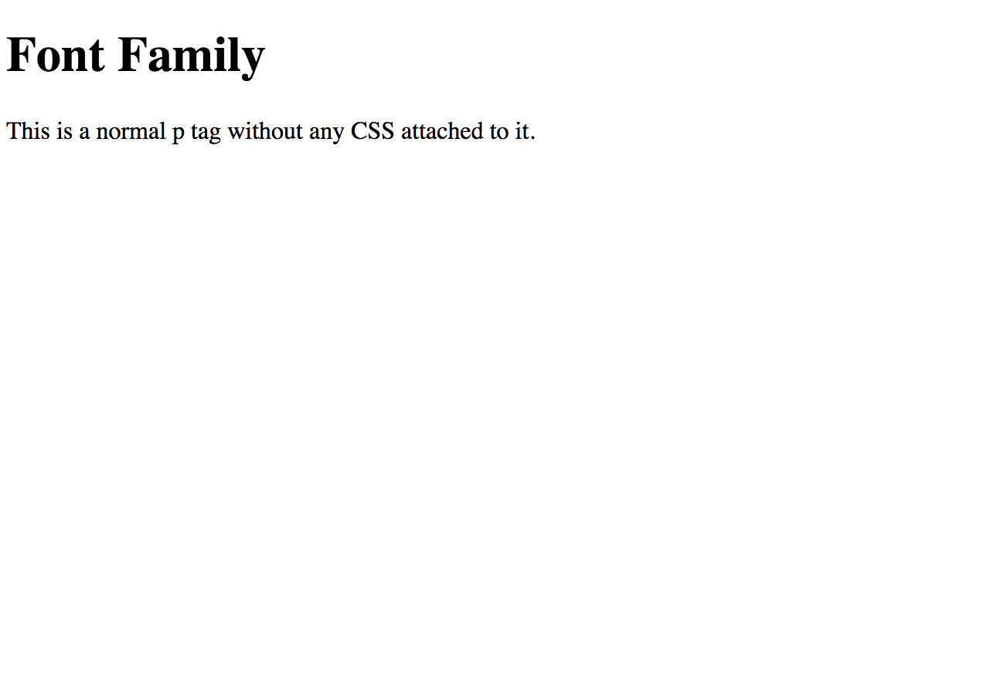
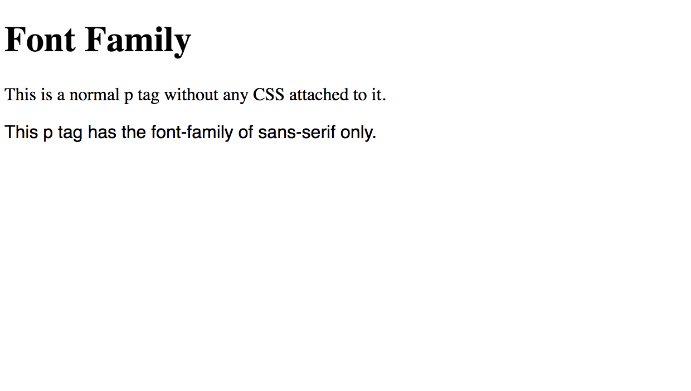
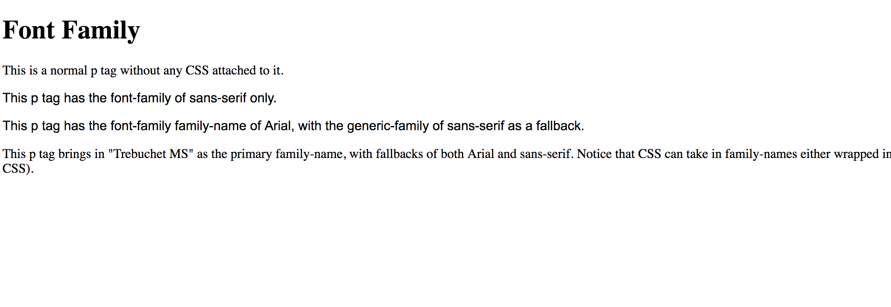
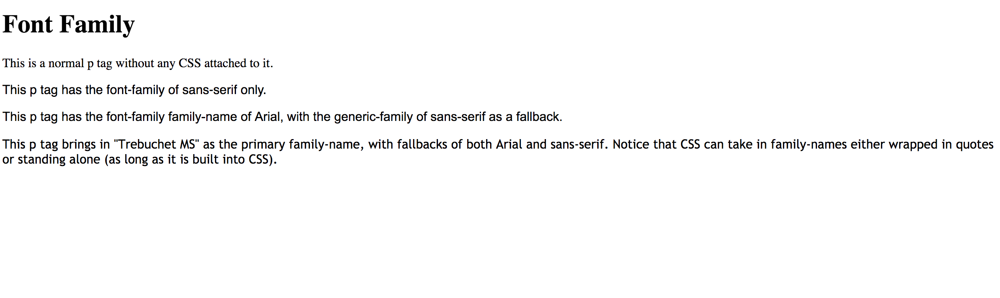
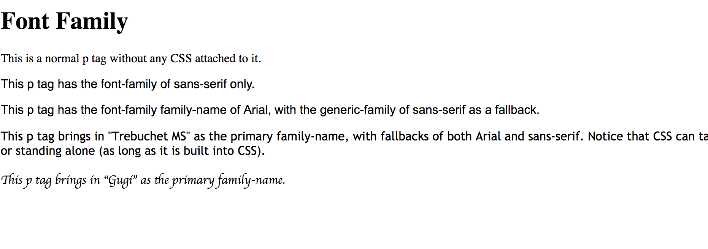
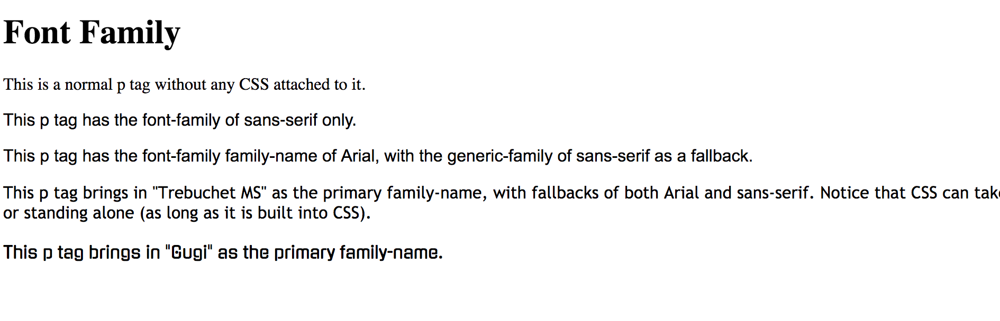

# 1.1: Font Family

As far as the most-obvious change to adjusting `HTML` text, changing the font from Times New Roman is a good place to start.  


CSS has a number of different options that allow for font change to take place. We will see that `font-family` has two specific categories: `family-name` and `generic-family`. The best way to look at this is to see `family-name` as a specific font or style, where `generic-family` is the fallback in case the browser can't handle a certain font of your choice.  


Let's have you work through `font-family` in your own file. Time to create \(if you didn't in the overview section\) your first file for this course! This is the structure you should be emulating:  


```text
    └── css-fundamentals
        └── 1-css-fonts
            └── 1.1-font-family.html
```

## Setting Up Your HTML File

As you create a new file and open it in your text editor of choice \(i.e. Visual Studio Code, Sublime, Atom, etc.\) you will see a blank file. Add the following to your file:  


```markup
<!DOCTYPE html>
<html lang="en">
  <head>
    <meta charset="UTF-8">
    <meta name="viewport" content="width=device-width, initial-scale=1.0">
    <meta http-equiv="X-UA-Compatible" content="ie=edge">
    <title>CSS Font Family</title>
  </head>
  <body>
  </body>
</html>
```

This sets up your `HTML` file with all the necessary data to run the file in a browser \(I am assuming that you will have a basic understanding of HTML and how to run it on your browser to see a local version of your site. If you are unable to do this, please pause this lesson and delve into an HTML Fundamentals series\).  


In your `body` tag, add an `h1` tag with a title of 'Font Family'; then below, add a `p` tag saying 'This is a normal p tag without any CSS attached to it.' It should look like this:  


```markup
...
<body>
  <!-- Add new code below -->
  <h1>Font Family</h1>
  <p>This is a normal p tag without any CSS attached to it.</p>
</body>
...
```

If you open in it your browser, you should see this:



## Changing The Font

Let's change the font! Why don't we start with the basics, shall we? Times New Roman \(the default for `HTML`\) has a `generic-family` of `serif`. Basically, this means that a capital I has the cross marks on both top and bottom, instead of just a vertical line. If we change it to `sans-serif` it is, well, 'sans', or without, serif styling.  


We are now going to add another `p` tag with inline-styling that changes the `font-family` to `sans-serif`. Add the following under your existing `p` tag:  


```markup
...
<p>This is a normal p tag without any CSS attached to it.</p>
<!-- Add new code below -->
<p style="font-family: sans-serif">This p tag has the font-family of sans-serif only.</p>
</body>
```

You should now see this:



## Generic-Family

Great! You can now see that you have changed the styling to make the font `sans-serif`. The `sans-serif` feature is considered the `generic-family` type within the `font-family` property. It is the basic of font manipulation.  


The `generic-family` values can include:   


| Generic-Families | Definition | Examples |
| :--- | :--- | :--- |
| serif | Glyphs have finishing strokes, flared or tapering ends, or have actual serifed endings | Times New Roman, Lucida Bright, Lucida Fax, Palatino, Pallidio |
| sans-serif | Glyphs have stroke endings that are plain | Open Sans, Arial, Impact, Trebuchet MS |
| cursive | Glyphs in cursive fonts generally have either joining strokes or other cursive characteristics beyond those of italic typefaces. The glyphs are partially or completely connected, and the result looks more like handwritten pen or brush writing than printed letterwork | Brush Script, Lucida Calligraphy, Apple Chancery |
| fantasy | Fantasy fonts are primarily decorative fonts that contain playful representations of characters | Papyrus, Huculanum, Party LET, Curlz MT, Harrington |
| monospace | All glyphs have the same fixed width | Fira Mono, DejaVu Sans Mono, Menlo, Consolas, Monaco |

## Family-Name

Now that we have set the basics, let's include some specific fonts that we can change our text to. In your `HTML` file, under what you currently have, add these two `p` tags:  


```markup
...
<p style="font-family: sans-serif">This p tag has the font-family of sans-serif only.</p>
<!-- Add new code below -->
<p style="font-family: Arial, sans-serif">This p tag has the font-family, family-name of Arial, with the generic-family of sans-serif as a fallback</p>
<p>This p tag brings in "Trebuchet MS" as the primary family-name, with Arial and sans-serif as a fallback.</p>
...
```

Within the first tag we just added, we can see that we added `Arial` as our family-name. When you run the code, you should see this:



As you can see, the font for the new `p` tag is the same as when we simply had the generic-family of sans-serif. The reason for this is that the sans-serif category defaults to Arial as the font of choice, just as how the serif category defaults with Times New Roman \(the default font for `HTML`\).  


You might have noticed, however, that there is no styling on the second `p` tag that we created just now. Let's add some and, as you guessed it, it will include "Trebuchet MS" as our font of choice. Add this to you `p` tag:  


```markup
<p style="font-family: 'Trebuchet MS', Arial, sans-serif">This p tag brings in "Trebuchet MS" as the primary family-name, with Arial and sans-serif as a fallback.</p>
```

You should now see this:



## Two Things to Notice

Two things: first, notice how "Trebuchet MS" is in quotes, where Arial was not. Why? Fun fact, `CSS` **does not** require quotes! "Trebuchet MS" will work just as well as Trebuchet MS. So, why would we include them? We are dealing with two words for this font and, since there is a space \(as opposed to a dash \[`-`\] like in `sans-serif`\), it is best to include quotes to avoid confusion of thinking these are two separate fonts.  


The second thing to notice is that we are including **BOTH** "Trebuchet MS" and Arial! How can you add two family-fonts?? It is all about providing a fallback for...struggling...browsers \(_cough_ Internet Explorer _cough_\). If said browser cannot understand the first family-font, it can abort that one and fallback to a secondary; the same methodology with the generic-family. Thus, with this setup, we are bringing in "Trebuchet MS" with two safety nets of Arial and sans-serif.

## One More Try

Let's include one more `p` tag. Add the following:

```markup
...
<p style="font-family: 'Trebuchet MS', Arial, sans-serif">This p tag brings in "Trebuchet MS" as the primary family-name, with Arial and sans-serif as a fallback.</p>
<!-- Add new code below -->
<p style="font-family: Gugi, cursive">This p tag brings in "Gugi" as the primary family-name.</p>
...
```

You should see this:



This doesn't seem right! "Gugi" should look like this:



So why is this not working? `CSS` does not have "Gugi" as a default font so, since it didn't understand what we were asking it to do, it aborted out family-font and fellback to our generic-font of cursive \(which is the correct category for "Gugi"\).  


You can only use fonts that `CSS` recognizes; otherwise, you need to import your desired font \(we will look at that a little later\).

