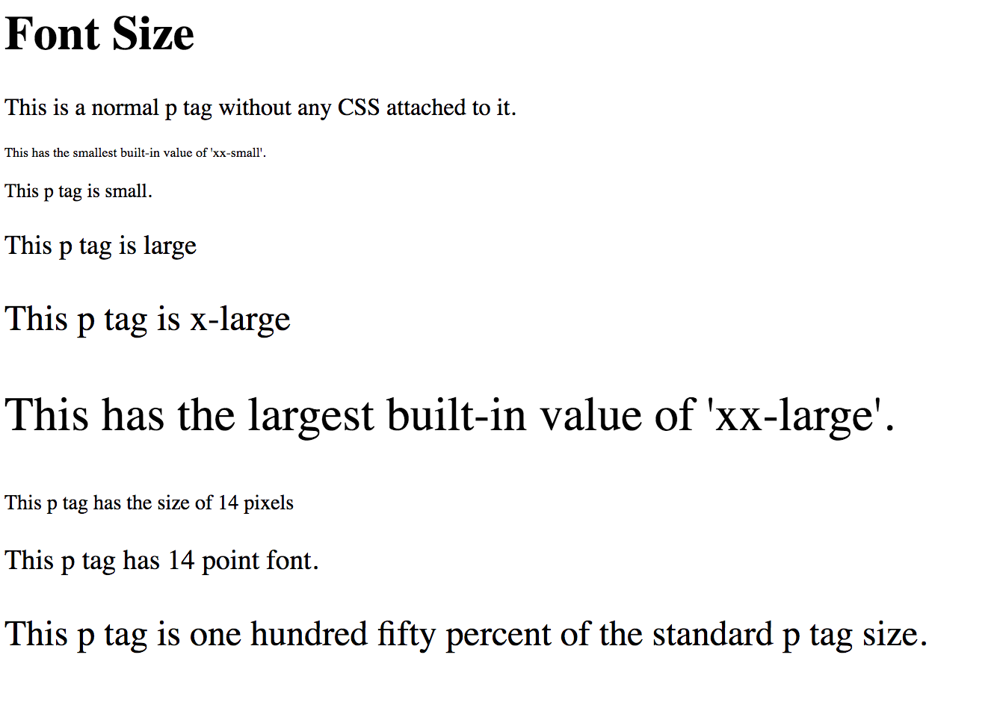

# 1.2: Font Size

Now that we have fonts moderately under our belt, another obvious adjustor for fonts would be the ability to change the size of your text.  


First, let's add another file:  


```text
    └── css-fundamentals
        └── 1-css-fonts
            ...
            └── 1.2-font-size.html
```

And go ahead and add the following code:  


```markup
<!DOCTYPE html>
<html lang="en">
  <head>
    <meta charset="UTF-8">
    <meta name="viewport" content="width=device-width, initial-scale=1.0">
    <meta http-equiv="X-UA-Compatible" content="ie=edge">
    <title>CSS Font Size</title>
  </head>
  <body>
    <h1>Font Size</h1>
    <p>This is a normal p tag without any CSS attached to it.</p>
  </body>
</html>
```

You will see this:


Again, pretty boring; so let's add some styling to this!

## Font-Size Values

`Font-size` adjusts just that, the size of your font. However, there are many options to choose from. Here are the built-in options:  


| Size Values | Descriptions |
| :--- | :--- |
| xx-small | Sets the font-size to an extra-extra small size |
| x-small | Sets the font-size to an extra small size |
| small | Sets the font-size to a small size |
| medium | Sets the font-size to a medium size \(**this is the default**\) |
| large | Sets the font-size to a large size |
| x-large | Sets the font-size to an extra large size |
| xx-large | Sets the font-size to an extra-extra large size |
| smaller | Sets the font-size to a smaller size than the parent element |
| larger | Sets the font-size to a larger size than the parent element |

So, let's apply some of these! Add the following code to see a good visual of what's going on:

```markup
...
<p>This is a normal p tag without any CSS attached to it.</p>
<!-- Add new code below -->
<p style="font-size: xx-small">This has the smallest built-in value of 'xx-small'.</p>
<p style="font-size: small">This p tag is small.</p>
<p style="font-size: large">This p tag is large</p>
<p style="font-size: x-large">This p tag is x-large</p>
<p style="font-size: xx-large">This has the largest built-in value of 'xx-large'.</p>
...
```

You should then see this:


Not exactly precise, right? It seems intuitive; `large` will be larger than `medium`, etc. But is there a way to add accuracy to this `CSS` property? YES!

## Length Units

`Font-size` measures its size off of the length of the letter 'm', being that it is usually the widest letter. There are two types of length that font-size \(and really anything that uses length\) uses: `absolute length` and `relative length`. These are the options for both:  


| Absolue Length Units | Descriptions |
| :--- | :--- |
| cm | Centimeters |
| mm | Millimeters |
| in | Inches \(1in = 96px = 2.54cm\) |
| px\* | Pixels \(1px = 1/96in\) |
| pt | Points \(1pt = 1/72in\) |
| pc | Picas \(1pc = 12pt\) |

\*Pixels are technically relative to the size of the viewing device. A pixel is dot of the display \(i.e. 1080p resolution on a TV is 1080 pixels wide\).  


| Relative Length Units | Descriptions |
| :--- | :--- |
| em | Relative to the width of the letter 'm' \(2em = 2 times the size of the current font\) |
| ex | Relative to the height of the letter 'x' \(**rarely used**\) |
| ch | Relative to the width of the number '0' |
| rem | Relative to the font-size of the root element |
| vw | Relative to the width of the viewing device's window |
| vh | Relative to the height of the viewing device's window |
| vmin | Relative to 1% of the viewing device's smaller dimension |
| vmax | Relative to 1% of the viewing device's larger dimension |
| % | Relative to the parent element |

**TIP**: `em` and `rem` are practical in creating perfectly scalable layouts!  


Let's play with some absolute and relative values! Add this below your existing code:  


```markup
...
<p style="font-size: xx-large">This has the largest built-in value of 'xx-large'.</p>
<!-- Add new code below -->
<p style="font-size: 14px">This p tag has the size of 14 pixels</p>
<p style="font-size: 14pt">This p tag has 14 point font.</p>
<p style="font-size: 150%">This p tag is one hundred fifty percent of the standard p tag size.</p>
...
```

You should now see this:



