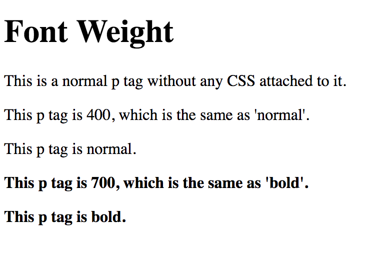

# 1.3: Font Weight

`Font-weight` is the `CSS` property that **bolds** your text. It, like `font-size` is relatively straightforward. First, we will create our new file and add the base `HTML`:  


```text
    └── css-fundamentals
        └── 1-css-fonts
            ...
            └── 1.3-font-weight.html
```

```markup
<!DOCTYPE html>
<html lang="en">
  <head>
    <meta charset="UTF-8">
    <meta name="viewport" content="width=device-width, initial-scale=1.0">
    <meta http-equiv="X-UA-Compatible" content="ie=edge">
    <title>CSS Font Weight</title>
  </head>
  <body>
    <h1>Font Weight</h1>
    <p>This is a normal p tag without any CSS attached to it.</p>
  </body>
</html>
```

Since this will look like what you have already created, we will forego the screenshot.  


Now, let's look at the options that come with font-weight:  


| Weight Values | Descriptions |
| :--- | :--- |
| normal | Defines normal characters \(**this is the default**\) |
| lighter | Defines thinner characters |
| bolder | Defines thicker characters |
| bold | Defines thick characters |
| 100 | Numerical value that defines from thick to thin characters |
| 200 | Numerical value that defines from thick to thin characters |
| 300 | Numerical value that defines from thick to thin characters |
| 400 | Numerical value that defines from thick to thin characters \(the same as `normal`\) |
| 500 | Numerical value that defines from thick to thin characters |
| 600 | Numerical value that defines from thick to thin characters |
| 700 | Numerical value that defines from thick to thin characters \(the same as `bold`\) |
| 800 | Numerical value that defines from thick to thin characters |
| 900 | Numerical value that defines from thick to thin characters |

Let's put this into practice. Add the following within your `body` tags of your `HTML` file, below your existing `p` tag:  


```markup
...
<p style="font-weight: 400">This p tag is 400, which is the same as 'normal'.</p>
<p style="font-weight: normal">This p tag is normal.</p>
<p style="font-weight: 700">This p tag is 700, which is the same as 'bold'.</p>
<p style="font-weight: bold">This p tag is bold.</p>
...
```

You should see this:



