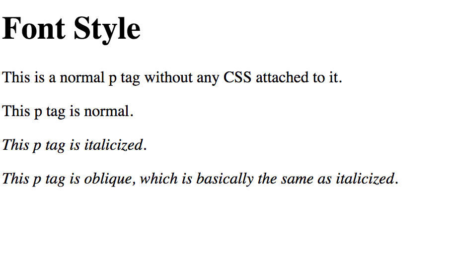

# 1.4: Font Style

`Font-style`, like font-weight, is rather straightforward as well. It is the `CSS` property that determines if the text is _italics_ or _oblique_.  


Since we have done it a couple times, let's have you set up your file and `HTML` file the same as you had in the previous lessons.  


Font-style only has three values:  


| Style Values | Descriptions |
| :--- | :--- |
| normal | Defines normal font style \(**this is the default**\) |
| italic | Defines italic font style |
| oblique | Defines oblique font style |

Now, add the following code within your `body` tags:  


```markup
...
<p style="font-style: normal">This p tag is normal.</p>
<p style="font-style: italic">This p tag is italicized.</p>
<p style="font-style: oblique">This p tag is oblique, which is basically the same as italicized.</p>
...
```

You should now see this:



## Italic vs. Oblique

What is the difference between `italic` and `oblique` font-style? Is there much of a difference at all?  


The short answer is that `italic` is a font in itself, designed primarily for calligraphy. It is meant to look as a designed font, emulating cursive. `Oblique` is normal font that is simply slanted \(usually 8-12 degrees\). Incidentally, they look very similar.

