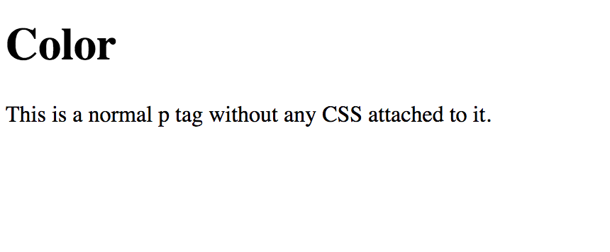

# 1.5: Color

We have now come into a `CSS` property that does not include the word 'font' in its property name. `Color`, however, only influences the color of your font, and thus belongs here in this module.  


Create a file and set up your `HTML` file. You should see this:



Though the idea of coloring your font is relatively understandable, there are multiple ways to bring in your color. `CSS` has built-in colors that you are free to use; click [here](https://www.quackit.com/css/color/charts/css_color_names_chart.cfm) to see the options available to you.  


There are, in addition to the 147 built-in colors that `CSS` has in its database, you are able to pick the EXACT color using different methods.

## RGB Colors

`RGB` colors stand for Red Green Blue, where all three values are added together to create your custom color. The parameters for each value ranges between `0-255` or `0%-100%`, and are separated by a comma \(`,`\) \(i.e. `rgb(10, 100, 255)`, `rgb(5%, 25%, 100%)`\).

### RGBA Colors

RGB colors can add a fourth value \(the alpha value\) which determines the opacity of your color. The parameters of the alpha value ranges between `0-1.0`, where `0` is fully transparent and 1.0 is fully opaque \(i.e. `rgba(10, 100, 255, 0.5)`\).

## HSL Colors

`Hue Saturation Level`, or `HSL` colors work off of a color wheel, where the three parameters used decide color, saturation, and light respectively.  


The first value has a paramter of `0-360` degrees and can be written with, or without `deg` after the number. For instance, if you want to have the color blue, the angle on the HSL color wheel is at 240 degrees and can be written either as `240deg` or simply `240`.  


The second value pertains to a saturation level of `0%-100%`, where `100%` is full color and `0%` is greyscale.  


The third value pertains to the level of light that filtered into the color, where `0%` is black, `100%` is white, and `50%` is the 'normal' color level.  


HSL color examples could look like: `hsl(30deg, 100%, 50%)` and `hsl(120, 75%, 100%)`, etc.

### HSLA Colors

Like `RGB` colors, `HSL` can add an `alpha` value to determine the opacity of the color you are incorporating. And, like `RGBA` colors, the alpha value has the parameters ranging between `0-1.0`.  


Some examples of `HSLA` colors are: `hsla(30deg, 50%, 90%, 0.5)` and `hsla(302, 100%, 100%, 0.75)`.

## Hexadecimal Colors \(Six-Digit\)

`Hexadecimal`, or `Hex`, colors are preceded with a `#` and are defined with six alpha-numeric characters, ranging between `0-9` and `A-F`. Hex colors are structured with six digits where the first two pertain to red, digits three and four pertain to green, and the last two pertain to blue \(i.e. `#RRGGBB`\).

### Three-Digit Hex Colors

For shorthand purposes, hex colors can be condensed from six to three digits if, and only if, the two digits pertaining to EACH color are the same \(i.e. `#AABBCC` =&gt; `#ABC`\); alternating or random digits cannot be condensed \(i.e. `#E1E1E1`\).

### Eight-Digit Hex Colors

Hex colors, like `RGBA` and `HSLA` can also include opacity in an alpha parameter. However, instead of ranging the opacity numerically, hex colors utilize `0-F` to represent different opacity percentages \(i.e. `1A` = 10%, `80` = 50%, `E6` = 90%, `FF` = 100%\).

### Four-Digit Hex Colors

Like three-digit hex colors, you are able to condense your hex color from eight to four digits, as long as they follow the same guidelines mentioned above.

## Implementing Color

Now that we have paused to see our color options for CSS, it is time to implement them into our font!  


First, let's add the following code under our existing `p` tag:  


```markup
...
<p id="one">This is written in blue.</p>
<p id="two">This is written in red (with the hexcolor of #f44b42).</p>
<p id="three">This is written in green (with rgb(17, 119, 29)).</p>
<p id="four">This is written in sepia (with hsl(16, 68%, 22%))</p>
...
```

## Quick Aside

Notice something? Before, we would include the CSS styling within the HTML tags \(where you could see `<p style="font-family: sans-serif">...</p>`\). We just added `id` attributes to our tags instead. Where's the CSS??  


We are going to implement our CSS in a slightly different way!

## Within the Style Tag

Another way to incorporate CSS into your HTML file is to add a `style` tag above your code \(but still within the `body` tag\). This is helpful in a couple different ways:

1. If you have large amounts of CSS to add to your code, this is a cleaner way to incorporate it.
2. When running the file, your computer reads HTML top-to-bottom; by having your `style` tag above your code, your browser will prep your CSS **before** it actually renders your HTML, making for much faster loading time!

So, let's add our styling using this new way of incorporating CSS! Right after your opening `body` tag, add the following code:  


```markup
...
<body>
  <!-- Add new code below -->
  <style>
    #one {
      color: blue;
    }
  </style>
  ...
</body>
```

What did we just do? In CSS the `#` calls for a specific `id` and whatever follows it pertains to the name of said id. So, when we see `#one`, CSS is alluding to the HTML tag with `id="one"` attributed to it.  


After the selector \(in this case, the `#one`\), there are a pair of curly brackets \(`{}`\). Like the opening and closing angle brackets \(`<>`\) of HTML, everything with the curly brackets in CSS is attributed to that specific selector--the CSS style of `color` that we are setting to `blue` is directly attributed to our selector \(`#one`\), which is associated with our second `p` tag.&lt;br

You should see this:


Now, let's add colors to our second and third `id` selectors. Add the following right under our existing CSS code within the `style` tag:  


```markup
<style>
  #one {
    color: blue;
  }

  /* Add new code below */
  #two {
    color: #f44b42;
  }

  #three {
    color: rgb(17, 119, 29);
  }
</style>
```

You should now see this:


## One More

Great work! There is a lot here so if you are tracking, well done! If you are struggling a little, take some time to go over what we have covered in this lesson before going on.  


There is, however, one more `p` tag that doesn't have any styling attached to it. Add the color mentioned in the content of the actual HTML tag to our `style` tag under the existing CSS code.  


It should look like this:


## Challenge

Time to stretch you and have you incorporate all of the CSS styles we have covered thus far!  


**Make a** `p` **tag with the font family-name of Trebuchet MS and the generic-family of sans-serif; make it 16-point font; bold; italicized; make it orange using hex colors; AND link the CSS to an id of** `"five"` **going through the** `style` **tag. Make it say: "This is the Challenge Answer!"**  


You should end with this:


## Final Code

```markup
<!DOCTYPE html>
<html lang="en">
  <head>
    <meta charset="UTF-8">
    <meta name="viewport" content="width=device-width, initial-scale=1.0">
    <meta http-equiv="X-UA-Compatible" content="ie=edge">
    <title>CSS Color</title>
  </head>
  <body>
    <style>
      #one {
        color: blue;
      }  

      #two {
        color: #f44b42;
      }

      #three {
        color: rgb(17, 119, 29);
      }

      #four {
        color: hsl(16, 68%, 22%);
      }

      #five {
        font-family: "Trebuchet MS", sans-serif;
        font-size: 16pt;
        font-weight: bold;
        font-style: italic;
        color: #e0702a;
      }
    </style>

    <h1>Color</h1>
    <p>This is a normal p tag without any CSS attached to it.</p>
    <p id="one">This is written in blue.</p>
    <p id="two">This is written in red (with the hexcolor of #f44b42).</p>
    <p id="three">This is written in green (with rgb(17, 119, 29)).</p>
    <p id="four">This is written in sepia (with hsl(16, 68%, 22%)).</p>

    <p id="five">This is the Challenge Answer!</p>
  </body>
</html>
```

