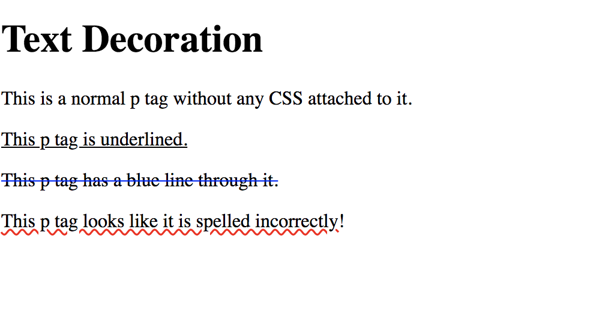

# 1.6: Text Decoration

At this point, we have been able to change the font, size, bold, italics, and color of your text! Well done!! That already is a lot of styling that you now have access to in your web development!  


Now, we are going to underline, strike through, etc. our text; that is what `text-decoration` does.  


So, first thing, add a file for this lesson and set up your HTML file as we have been doing thus far \(go ahead and add a `style` tag at the top of your `body` tag--we will be calling our CSS the same we did last lesson\).

## What is Text-Decoration?

This is actually the first CSS property that is a combination of a number of related properties \(CSS does this sometimes; it appears in other properties like `border`, `padding`, `margin`, etc.\).  


`Text-decoration` is a combination of the following:  


| Text-Decoration Properties | Descriptions | Required? |
| :--- | :--- | :--- |
| text-decoration-line | Sets the kind of line to use | Yes |
| text-decoration-color | Set the color of the line used | No |
| text-decoration-style | Set the style of the line used | No |

### Text-Decoration-Line

| Line Values | Descriptions |
| :--- | :--- |
| none | Specifies no line used \(**this is the default**\) |
| underline | Specifies that a line will be displayed under the text |
| overline | Specifies that a line will be displayed over the text |
| line-through | Specifies that a line will be displayed through the text |

_**Fun Fact**_: You can implement multiple values within this property!

### Text-Decoration-Color

`Text-decoration-color` implements a value with the same parameters as discussed in the `color` lesson. This property will allow any of the 147 built-in colors of CSS, as well as any value of `rgb`, `rgba`, `hsl`, `hsla`, or `hex` colors.

### Text-Decoration-Style

| Style Values | Descriptions |
| :--- | :--- |
| solid | Specifies that a line will be displayed as a solid line \(**this is the default**\) |
| double | Specifies that a line will be displayed as a double line |
| dotted | Specifies that a line will be displayed as a dotted line |
| dashed | Specifies that a line will be displayed as a dashed line |
| wavy | Specifies that a line will be displayed as a wavy line |

### All Together

Rather than having to implement `text-decoration-line`, `text-decoration-color`, and `text-decoration-style`, CSS combined these properties to fit under the singular umbrella of `text-decoration`. This is very convenient!  


However, do you have to utilize all three properties within `text-decoration`? No! The only property that is required is `text-decoration-line`; otherwise, you are free to include the others, or not \(i.e. `text-decoration: underline solid red`, `text-decoration: underline solid`, `text-decoration: underline red`, and `text-decoration: underline` all work; `text-decoration: red` **does not** work\).

## Implementation

Let's see what this can do! Add the following code:  


```markup
...
<p id="one">This p tag is underlined.</p>
<p id="two">This p tag has a blue line through it.</p>
<p id="three">This p tag looks like it is spelled incorrectly!</p>
...
```

Adding the CSS within your `style` tag, add the styling that each `p` tag is saying.

## Finished Code

```markup
<!DOCTYPE html>
<html lang="en">
  <head>
    <meta charset="UTF-8">
    <meta name="viewport" content="width=device-width, initial-scale=1.0">
    <meta http-equiv="X-UA-Compatible" content="ie=edge">
    <title>CSS Text Decoration</title>
  </head>
  <body>
    <style>
      #one {
        /* 
        text-decoration-line: underline;
        */
        text-decoration: underline;
      }

      #two {
        /* 
        text-decoration-line: line-through;
        text-decoration-color: blue;
         */
        text-decoration: line-through blue;
      }

      #three {
        /* 
        text-decoration-line: underline;
        text-decoration-color: red;
        text-decoration-style: wavy; 
        */
        text-decoration: underline red wavy;
      }
    </style>

    <h1>Text Decoration</h1>
    <p>This is a normal p tag without any CSS attached to it.</p>
    <p id="one">This p tag is underlined.</p>
    <p id="two">This p tag has a blue line through it.</p>
    <p id="three">This p tag looks like it is spelled incorrectly!</p>
  </body>
</html>
```

You should see this:



