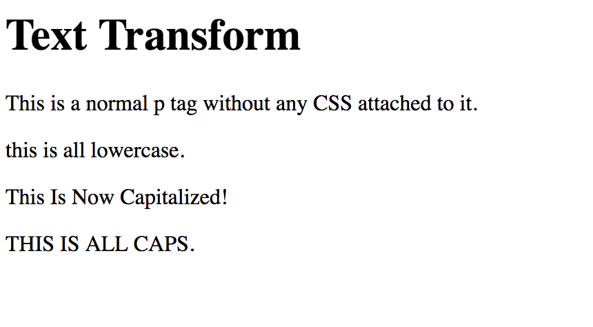
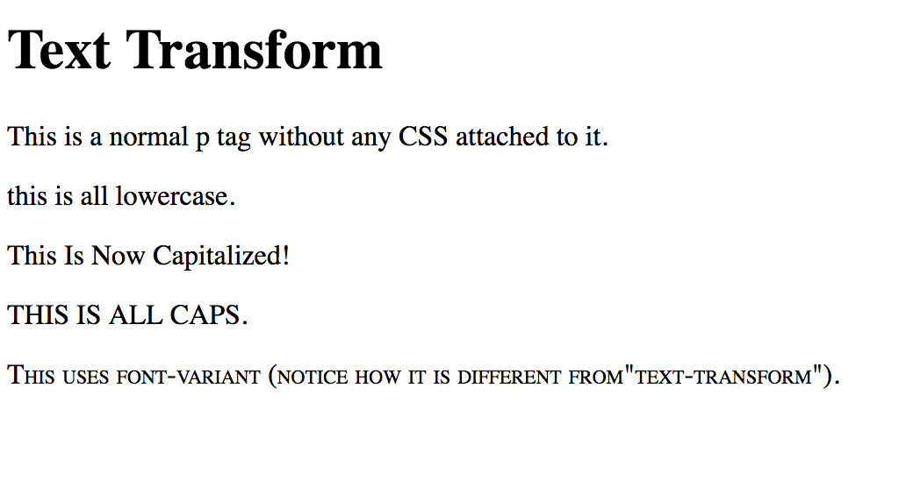

# 1.7: Text Transform

We have been able to do so much with our text using a variety of CSS properties! One more very practical property is `text-transform`. This property allows you to capitalize or lowercase you text. This is particularly helpful when you have people typing in forms to create unity \(as well as a certain design that you are striving for\).  


Again, start this lesson by setting up your HTML file.

## Text-Transform Options

| Transform Values | Descriptions |
| :--- | :--- |
| none | No capitalization.  Text renders as it is typed in \(**this is the default**\) |
| capitalize | Transforms the first letter of each word to uppercase |
| uppercase | Transforms all letters to uppercase |
| lowercase | Transforms all letters to lowercase |

Let's try this out! Add the following text:  


HTML:

```markup
...
<p id="one">This is all lowercase.</p>
<p id="two">this is now capitalized!</p>
<p id="three">This is all caps.</p>
...
```

Now, in the `style` tag, set the first `id` to `lowercase`, the second to `capitalize`, and the third to `uppercase`. If you run it, you should see this:



## Uppercase vs. Small-Caps

There is one other property that affects the capitalization of letters. This one, however, capitalizes every letter, but the lowercase letters become `small-caps`. The CSS property is called `font-variant`.  


Let's try to compare the differences! Add this to your code:  


```markup
...
<p id="three">This is all caps.</p>
<!-- Add new code below -->
<p id="four">This uses font-variant (notice how it is different from "text-transform").</p>
...
```

And, if your `style` tag, add:  


```markup
<style>
...
#four {
  font-variant: small-caps;
}
</style>
```

You should see this:



