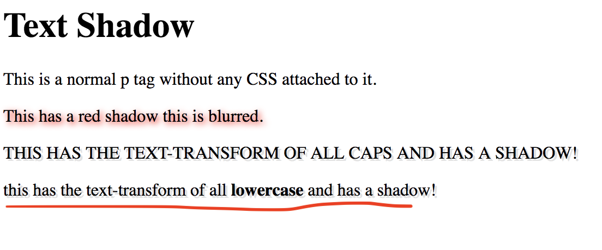
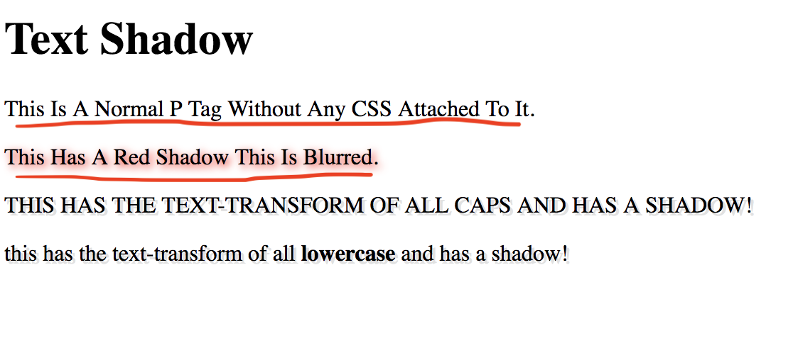
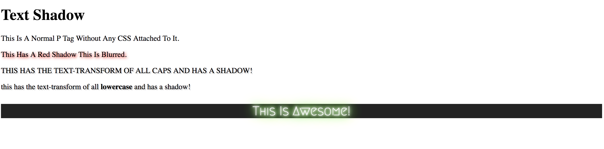
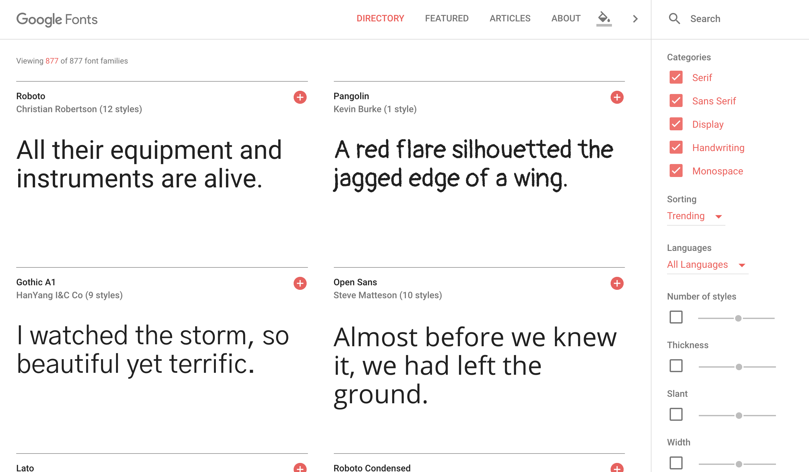
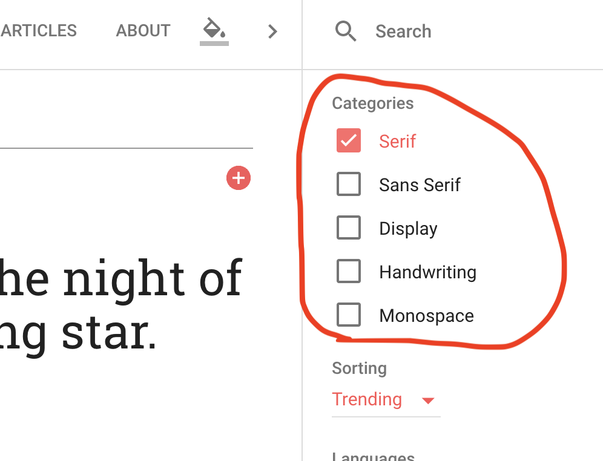
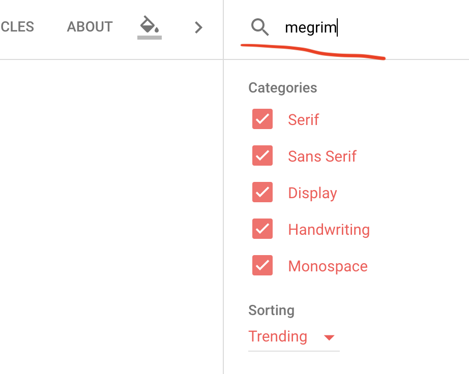
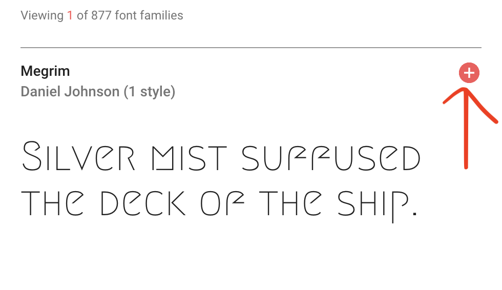
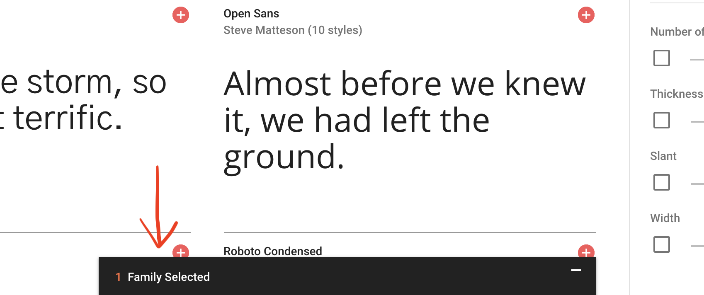
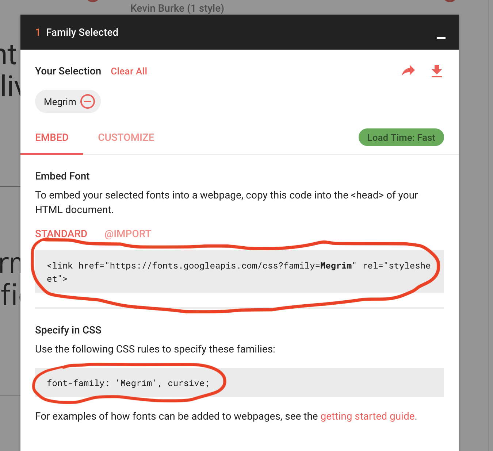

# 1.8: Text Shadow

On the last lesson of our font module, we are adding shadow to our text. This is also rather straight-forward, but adds features to customize the amount of shadow effect you might want to incorporate.  


`Text-shadow` brings in four values to build your shadow:  


| Shadow Values | Descriptions | Required? |
| :--- | :--- | :--- |
| h-shadow | The position of the horizontal shadow \(Negative values allowed\) | Yes |
| v-shadow | The position of the vertical shadow \(Negative values allowed\) | Yes |
| blur-radius | Blur radius of the shadow \(Default is 0\) | No |
| color | Color of the shadow \(Can use any CSS color parameter\) | No |

Let's try this out. Add and build out your `HTML` file. Then add the following:  


```markup
...
<p class="shadow1">This has a red shadow this is blurred.</p>
<p class="shadow2">This has the text-transform of all caps and has a shadow!</p>
<p class="shadow2" id="shadow">This has the text-transform of all <b>lowercase</b> and has a shadow!</p>
...
```

And in our our `style` tag:  


```markup
<style>
.shadow1 {
  text-shadow: 2px 2px 8px red;
}

.shadow2 {
  text-shadow: 2px 2px #e1e1e1;
  text-transform: uppercase;
}  

#shadow {
  text-transform: lowercase;
}
</style>
```

## Classes and Ids

Notice that we are now using the `class` attributes to our `p` tags, rather than our previously-used `id` attributes. Also notice that we are using **BOTH** `classes` and `ids` in our last `p` tag!  


And, notice that our `.shadow2` class \(remember: in `CSS`, classes are selected with a `.`, where `ids` are `#`\), we have the property of `text-transform` set to `uppercase`. In our `#shadow` selector, we have `text-transform: lowercase`.  


Here's the catch! **BOTH** `.shadow2` _and_ `#shadow` are attributes for our third `p` tag, however, they are both pulling in _different_ values for the _same_ attribute! What overrides what???  


Run your code and you should see this:



See what happened? The property in our `#shadow` selector took precedent! What does this tell us?  


**This tells us that** `ids` **overrule** `classes`**!**  


This is incredibly import to remember! If you ever have conflicting values between `ids` and `classes`, the `ids` will ALWAYS win!  


## Class and Id Recap

Remember that `ids` are unique to a specific attribute where `classes` can be used anywhere you might want to effect that specific change. Beyond that, if you create a property for that specific class, you can override it with overlaying an `id` upon it with a conflicting value that would effect that one feature.  


Let's push this a little further; in the top section of your `style` tag, add: `p { text-transform: capitalize }`. You should see this:



Notice that the first two sentences are now `capitalized` HOWEVER the second two remain as they were before! What does this tell us?  


### Two Things to See

1. There is another way to select specific attributes when using `CSS`; you are able to select elements directly \(i.e. `p` selects all `p` tags; `h1` selects all `h1` tags\).
2. When conflicting properties are involved, the line of priority follows this pattern: `Element Selectors` =&gt; `Classes` =&gt; `Ids`.

## Something Fun!

Let's try something fun! Copy and paste the following code \(look for the three areas of additions\) and run it to see what we just did. Take some time to look at the code and see if you can understand all that is happening!

```markup
<!DOCTYPE html>
<html lang="en">
  <head>
    <meta charset="UTF-8">
    <meta name="viewport" content="width=device-width, initial-scale=1.0">
    <meta http-equiv="X-UA-Compatible" content="ie=edge">
    <!-- Added new code below -->
    <link href="https://fonts.googleapis.com/css?family=Megrim" rel="stylesheet">
    <title>CSS Text Shadow</title>
  </head>
  <body>
    <style>
      p {
        text-transform: capitalize;
      }

      .shadow1 {
        text-shadow: 2px 2px 8px red;
      }

      .shadow2 {
        text-shadow: 2px 2px #e1e1e1;
        text-transform: uppercase;
      }  

      #shadow {
        text-transform: lowercase;
      }

      /* Added new code below */
      #fun {
        font-family: 'Megrim', cursive;
        color: #FFF;
        background-color: #232323; /* We will look at background colors in the next module, so hang tight! */
        text-shadow: 0 0 5px #FFF, 0 0 10px #FFF, 0 0 15px #FFF, 0 0 20px #49ff18, 0 0 30px #49FF18, 0 0 40px #49FF18, 0 0 55px #49FF18, 0 0 75px #49ff18;
        font-size: 20pt;
        text-align: center; /* We will cover this in the positioning module! */
      }
    </style>

    <h1>Text Shadow</h1>
    <p>This is a normal p tag without any CSS attached to it.</p>
    <p class="shadow1">This has a red shadow this is blurred.</p>
    <p class="shadow2">This has the text-transform of all caps and has a shadow!</p>
    <p class="shadow2" id="shadow">This has the text-transform of all <b>lowercase</b> and has a shadow!</p>

    <!-- Added new code below -->
    <div id="fun">
      <p>This is awesome!</p>
    </div>
  </body>
</html>
```

You should see this:



### Debriefing

1. We are linking to [Google Fonts](https://fonts.google.com/) to pull in a unique font that `CSS` does not come with out of the box \(`Megrim`\).
2. We created a `div` tag with the `id` of `fun`.
3. Inside our `div` tag, we have a `p` tag with NO `class` or `id`.
4. Inside our `style` tag, we select `#fun` and bring in the following:
   1. `Font-family` is pulling from [Google Fonts](https://fonts.google.com/).  When you select a font from this site, it prompts you which `generic-family` to append to it; in this case, it is `cursive`.
   2. The font itself is set to the `color` white.
   3. We set the `background-color` of the `div` to black \(we will look at `background-colors` in the next module\).
   4. `Font-size` is set to 20 point font.
   5. We are also bringing in `text-align` which centers our text within that `div` \(we will look at this in our positioning module\).
   6. Likely the most-complex of the bunch, we set the `text-shadow` in waves \(kind of like tree rings\), radiating outward, starting with white, and switching to `#49FF18`, which makes it effectively _glow_ green.

This gives the whole effect of a glowing neon sign. Fun!

## Quick Google Font Walk-Through

If you are interested in incorporating a font from [Google Fonts](https://fonts.google.com/), this will help you navigate the site.  


When you first get to the site, you will see something like this: 

You can browse `generic-family` values by selecting which you want to incorporate on the top right: 

You can also search a specific font on the top right: 

When you select a font, click the plus sign: 

When selected, you will see a bar appear on the bottom with your font selected: 

If you expand it, you will see both the link and the `CSS` value: 

Copy both and put them in their respective locations.

