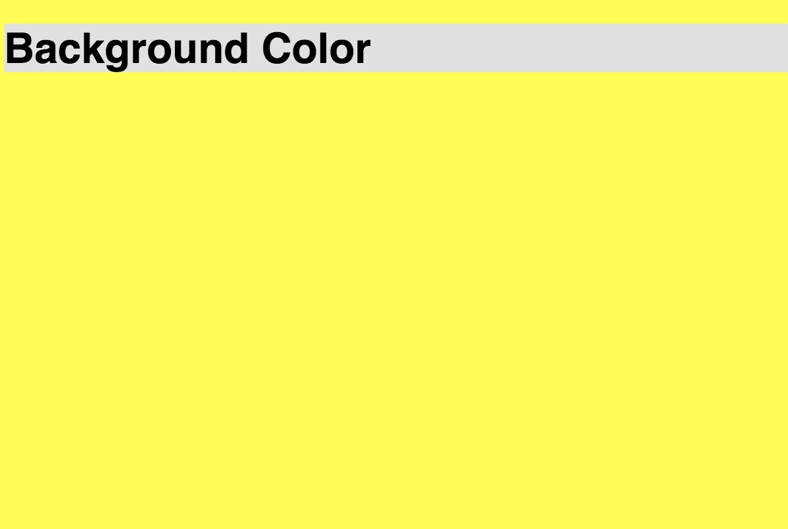
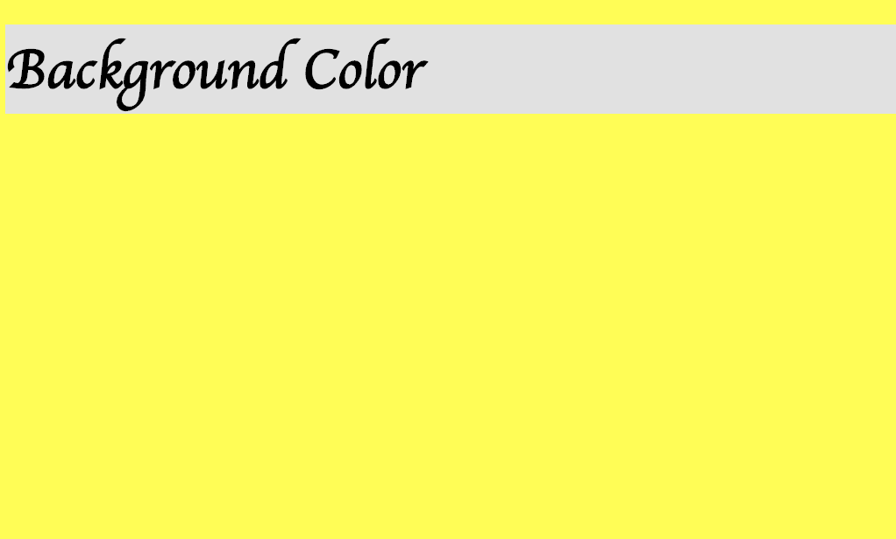

# 2.1: Background Color

`Background-color` changes the color of your background. Though the concept of this property is straight-forward, the tricky part of CSS background styling is knowing _where_ to append the styling.  


First, let's build our second directory and add both an `HTML` and `CSS` file:  


```text
    └── css-fundamentals
        └── 1-css-fonts
        └── 2-css-backgrounds
            └── 2.1-background-color.css
            └── 2.1-background-color.html
```

Leave your `CSS` file blank for the time being; add this to your `HTML` file:  


```markup
<!DOCTYPE html>
<html lang="en">
  <head>
    <meta charset="UTF-8">
    <meta name="viewport" content="width=device-width, initial-scale=1.0">
    <meta http-equiv="X-UA-Compatible" content="ie=edge">
    <link rel="stylesheet" href="2.1-background-color.css">
    <title>CSS Background Color</title>
  </head>
  <body id="bcBody">
    <style>
    </style>
    <div id="backgroundColor">
      <h1 id="bc">Background Color</h1> 
    </div>
  </body>
</html>
```

Let's add a background color to our `#bcBody` attribute. In your `style` tag, set a `background-color` to `yellow`. You should see this:


Not too hard, right? But what's going on here? The `body` tag is taking on the background-color of yellow, meaning that everything within that tag changes color. Since the `body` tag spans the entire window for your browser, the entire background color is changed.  


We can also add background colors to `div` tags! This time, let's use our `CSS` file that we have linked. In the `HTML` file, we have a `link` tag \(line 7 for this book\) that points to the `CSS` file that we also added. This link connects the `HTML` and `CSS` files together so that when one is used, it pertains to the other.  


So, cut the code from within our `style` tag \(`#bcBody { background-color: yellow }`\) and paste it inside the `CSS` file. If you run the code, you should see the same thing.  


Now, let's add some styling for our `div`. Add the following code inside your `CSS` file:  


```css
#backgroundColor {
  background-color: #e1e1e1;
  font-family: sans-serif;
}
```

You should now see this:



Notice that you now have a grey square overlayed upon the yellow backdrop. This grey square is actually the shape of the `div` itself.

## Practice in Priorities

We now have the three ways to add `CSS` to an `HTML` file! We also have `classes` and `ids`. But, how do these work together? What overrides what?  


As discussed in a the **Text-Shadow** lesson \(1.8\), `ids` trump `classes`. Therefore, anything conflicting in both attributes, will always produce the styling from the `id`.  


But there is more prioritization that needs discussion.  


### Nested Elements

First, what takes priority in nested elements? Example:  


```markup
<div id="backgroundColor">
  <h1 id="bc">Background Color</h1>
</div>
```

Does `#bc` take priority because it's the deepest, or does `#backgroundColor`, because it contains everything? Let's test it!  


In your `CSS` file, you see that `#backgroundColor` already has `font-family: sans-serif`. Add the following below your existing code then run:  


```css
#bc {
  font-family: cursive;
}
```

You should now see this:



What does this tell us? The nested element \(`#bc`\) takes priority! Why?  


Well, what does CSS stand for? **Cascading** Style Sheets. This means that CSS works its way down and deep. If an element is lower in the `HTML` file, it takes precedence, as well as if it is nested; the deeper an element goes, the higher priority it takes.

### Inline, Tag, or File?

What are the three ways to add styling to an `HTML` file? Inline \(i.e. `<p style="something">...</p>`\), via the `style` tag, or with the `CSS` file that is linked within the meta data of your `HTML` file.  


What if there are conflicting values of the same property in each of these? Which value wins? Here is a hint, the `CSS` file takes dead last. Why? It is a separate file that needs to be connected. So, then, why are `CSS` files used? They are the best ways to organize your CSS, especially when you have a lot of it!  


Let's try this out! Add `#bcBody { background-color: red; }` to your `style` tag and run it. You should now see a red background.  


Now, comment out that content \(`ctrl + /` for Windows or `cmd + /` for Mac\). Next, add the following to your `body` tag:  


```markup
<body id="bcBody" style="background-color: blue">
...
```

If you run it, you should see a blue background now!  


Now, what happens when you uncomment the CSS in the `style` tag?? Which color will the background be: red, or blue?  


What does this tell us? The cascading priority of CSS falls from the `CSS` file, to the content within the `style` tag, and ultimately with inline styling. Why? Because if you are making changes, this is the deepest element.  


Let's think of how `HTML` is read. If the browser reads it top to bottom, it reads first the link to our `CSS` file, then the `style` tag at the top of the `body` tag, and then, ultimately, the element itself, which, if it has inline styling, it gets applied last, and therefore, is what ultimately shows.

## Final Code

HTML:  


```markup
<!DOCTYPE html>
<html lang="en">
  <head>
    <meta charset="UTF-8">
    <meta name="viewport" content="width=device-width, initial-scale=1.0">
    <meta http-equiv="X-UA-Compatible" content="ie=edge">
    <link rel="stylesheet" href="2.1-background-color.css">
    <title>CSS Background Color</title>
  </head>
  <body id="bcBody" style="background-color: blue">
    <style>
      #bcBody {
        background-color: red;
      } 
    </style>
    <div id="backgroundColor">
      <h1 id="bc">Background Color</h1>
    </div>
  </body>
</html>
```

CSS:  


```css
#bcBody {
  background-color: yellow;
}

#backgroundColor {
  background-color: #e1e1e1;
  font-family: sans-serif;
}

#bc {
  font-family: cursive;
}
```

