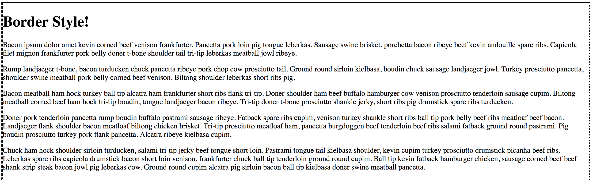
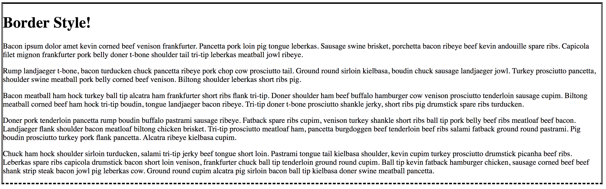
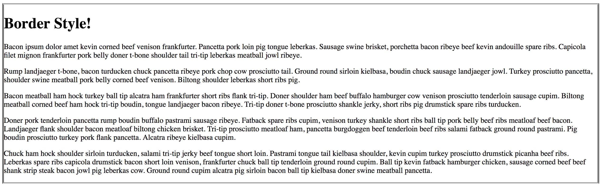

# 3.1: Border Style

The first thing to know about `border` properties is that they are actually combinations of `border-top`, `border-right`, `border-bottom`, and `border-left`. This will become pertainate soon.

## Border-Style Options

The `border-style` property sets what kind of line we want to border our container with. These are the options available:  


| Style Values | Descriptions |
| :--- | :--- |
| none | Specifies no border \(**this is the default**\) |
| hidden | The same as "none", except in border conflict resolution for table elements |
| dotted | Creates a dotted border |
| dashed | Creates a dashed border |
| solid | Creates a solid border |
| double | Creates a double border |
| groove | Creates a 3D grooved border. The effect depends on the border-color value |
| inset | Creates a 3D inset border. The effect depends on the border-color value |
| ridge | Creates a 3D ridge border. The effect depends on the border-color value |
| outset | Creates a 3D outset border. The effect depends on the border-color value |

### Multi-Option Styling

Here is where `border` being made up of the four sides comes into play! You are able to set a _different_ style for **EACH** side of your border!!!  


* `border-style: dotted solid double dashed;`
  * `border-top` is `dotted`
  * `border-right` is `solid`
  * `border-bottom` is `double`
  * `border-left` is `dashed`
* `border-style: dotted solid double;`
  * `border-top` is `dotted`
  * `border-right` **and** `border-left` are `solid`
  * `border-bottom` is `double`
* `border-style: dotted solid;`
  * `border-top` **and** `border-bottom` are `dotted`
  * `border-right` **and** `border-left` are `solid`
* `border-style: dotted;`
  * `border-top`, `border-right`, `border-bottom`, **and** `border-left` are `dotted`

## Implementation

Go ahead and set up your two files, `HTML` and `CSS` like you did in the previous module. In your `HTML` file, add the following:  


```markup
<!DOCTYPE html>
<html lang="en">
  <head>
    <meta charset="UTF-8">
    <meta name="viewport" content="width=device-width, initial-scale=1.0">
    <meta http-equiv="X-UA-Compatible" content="ie=edge">
    <link rel="stylesheet" href="3.1-border-style.css">
    <title>CSS Border Style</title>
  </head>
  <body>
    <div id="border">
      <h1>Border Style!</h1>
      <p>Bacon ipsum dolor amet kevin corned beef venison frankfurter. Pancetta pork loin pig tongue leberkas. Sausage swine brisket, porchetta bacon ribeye beef kevin andouille spare ribs. Capicola filet mignon frankfurter pork belly doner t-bone shoulder tail tri-tip leberkas meatball jowl ribeye.</p>
      <p>Rump landjaeger t-bone, bacon turducken chuck pancetta ribeye pork chop cow prosciutto tail. Ground round sirloin kielbasa, boudin chuck sausage landjaeger jowl. Turkey prosciutto pancetta, shoulder swine meatball pork belly corned beef venison. Biltong shoulder leberkas short ribs pig.</p>
      <p>Bacon meatball ham hock turkey ball tip alcatra ham frankfurter short ribs flank tri-tip. Doner shoulder ham beef buffalo hamburger cow venison prosciutto tenderloin sausage cupim. Biltong meatball corned beef ham hock tri-tip boudin, tongue landjaeger bacon ribeye. Tri-tip doner t-bone prosciutto shankle jerky, short ribs pig drumstick spare ribs turducken.</p>
      <p>Doner pork tenderloin pancetta rump boudin buffalo pastrami sausage ribeye. Fatback spare ribs cupim, venison turkey shankle short ribs ball tip pork belly beef ribs meatloaf beef bacon. Landjaeger flank shoulder bacon meatloaf biltong chicken brisket. Tri-tip prosciutto meatloaf ham, pancetta burgdoggen beef tenderloin beef ribs salami fatback ground round pastrami. Pig boudin prosciutto turkey pork flank pancetta. Alcatra ribeye kielbasa cupim.</p>
      <p>Chuck ham hock shoulder sirloin turducken, salami tri-tip jerky beef tongue short loin. Pastrami tongue tail kielbasa shoulder, kevin cupim turkey prosciutto drumstick picanha beef ribs. Leberkas spare ribs capicola drumstick bacon short loin venison, frankfurter chuck ball tip tenderloin ground round cupim. Ball tip kevin fatback hamburger chicken, sausage corned beef beef shank strip steak bacon jowl pig leberkas cow. Ground round cupim alcatra pig sirloin bacon ball tip kielbasa doner swine meatball pancetta.</p>
    </div>
  </body>
</html>
```

And, in case you are wondering, we are using [Bacon Ipsum](https://baconipsum.com/).  


Next, set your `border-style` to `solid` in your `CSS` file. You should see this:


## Practice

Go through the `border-style` values to see what each one looks like.

## Challenge

Replicate these:

1. 
2. 
3. 

### Answers

1. `border-style: solid dotted double dashed;`
2. `border-style: solid double dashed;`
3. `border-style: groove double;`

