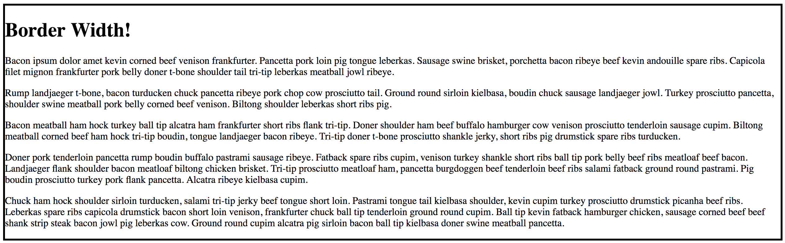
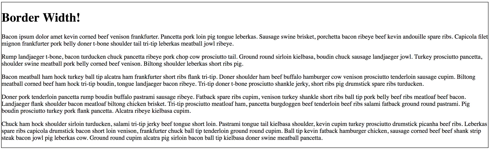
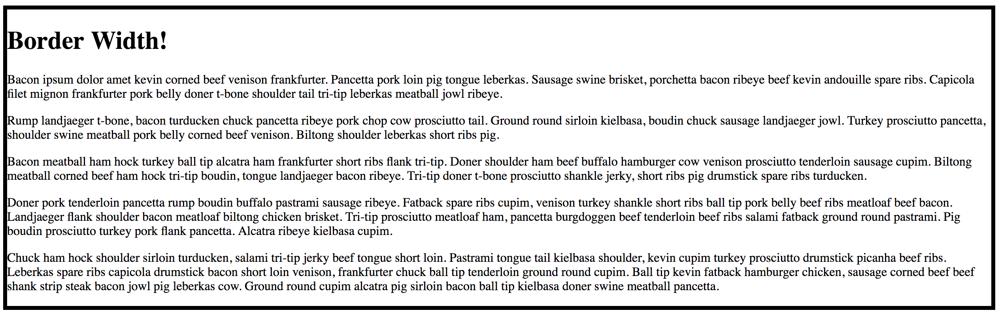

# 3.2: Border Width

The `border-width` property works very similarily to `border-style`. In both of these properties, we can separate which side\(s\) to thicken/thin.  

`Border-width` determines the thickness of the border lines themselves. There are three pre-established values: `medium`, which is the default value, `thin`, and `thick`. You can also incorporate any of the length unit values that `CSS` offers \(i.e. `20px`, `15rem`, `0.25em`\).

## Implementation

As before, create and setup your files, setting your `border-width` to `medium` in your `CSS` file. You should see this:

Since this is the default, the border should the same as when we started the last lesson. Now change that width to `thin`:

And then `thick`:

## Practice

Try your hand at incorporating different CSS length units \(can be found in module 1.2\).

