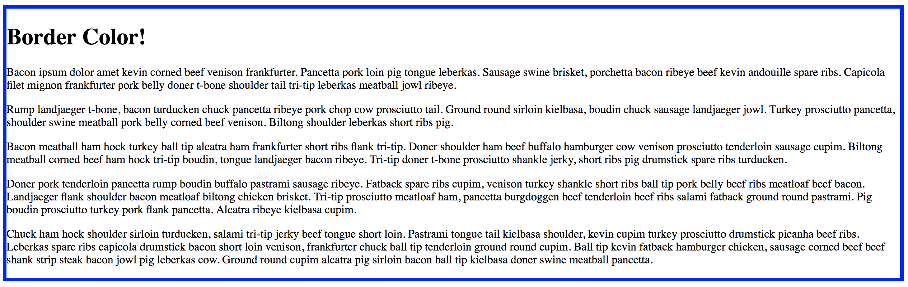
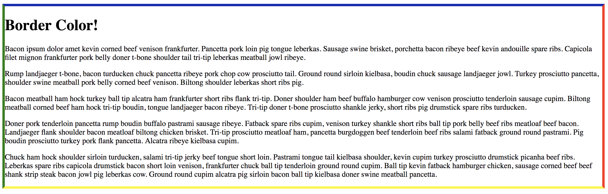

# 3.3: Border Color

`Border-color` brings in the 147 CSS set colors, as well as any of the `HSL`, `RGB`, and `Hex color` options that were discussed in module 1.5.  


And, as we have seen before, we can change the color on each side if desired, using the `top, right, bottom, left` setup that the `border` property comes with.  


In addition to this, like `border-width`, you _need_ `border-style` established in order to set the desired color.

## Transparent

In addition to the color options that were already discussed, `border-color` offers one more--`transparent`. And, as the name suggests, this allows the border to be transparent, which is different from no border altogether. This creates a border where that can be manipulated without actually seeing a border; the most-common manipulation being `border-radius`, which we will look at in the next lesson.

## Implementation

But first, let's work with `border-color`. Create and setup your files, so that the `HTML` file has the same content as previous lessons and the `CSS` file has this code:  


```css
#border {
  border-style: solid;
  border-width: thick;
}
```

Now, add a `border-color` of `blue`. You should see this:



## Challenge

Change the color of your border so that each side is a different color **and** utilize `HSL`, `RGB`, `Hex color`, and one of the CSS set colors.

## Possible Answer



```css
#border {
  border-style: solid;
  border-width: thick;
  border-color: hsl(241, 70%, 42%) rgb(255, 45, 22) #faf608 green;
}
```

