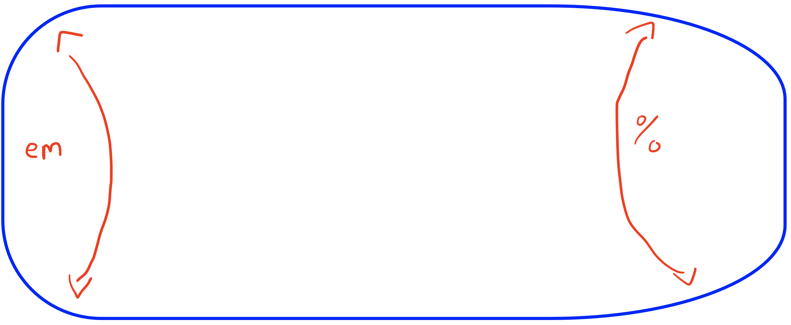
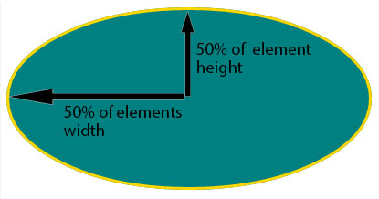
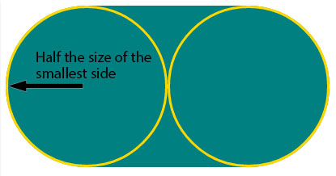

# 3.4: Border Radius

So far, we have see how to create a border, with a solid line, dotted line, dashed line, etc.; make it thicker/thinner; and change its color. Here, we will see how to change the border's shape.  


The `border-radius` property allows us to change our square border into a circle! Now, that might not sound all that interesting, but it allows us to manipulate the shape into anything in between those two as well \(i.e we could have curved corners, to a cup shape, to a tombstone shape, etc.\).  


## Structure

Up to this point, we have also been reminded that the `border` property is really four properties built in \(`border-top`, `border-right`, `border-bottom`, and `border-left`\). `Border-radius` changes that up just a little.  


We can still combine four values, but instead of top, right, bottom, left; the progression goes `top-left`, `top-right`, `bottom-right`, and `bottom-left`. Why is this the case?  


Border-radius changes the shape of the border through manipulating the corners, curving them until they form quarter circles \(in which, if all four corners are fully curved, we form a full circle\).  


Therefore, when we add multiple values in one property, we get this:

* `border-radius: 1em 2em 3em 4em;`
  * `top-left` is `1em`
  * `top-right` is `2em`
  * `bottom-right` is `3em`
  * `bottom-left` is `4em`
* `border-radius: 1em 2em 3em;`
  * `top-left` is `1em`
  * `top-right` **and** `bottom-left` are `2em`
  * `bottom-right` is `3em`
* `border-radius: 1em 2em;`
  * `top-left` **and** `bottom-right` are `1em`
  * `top-right` **and** `bottom-left` are `2em`
* `border-radius: 1em;`
  * `top-left`, `top-right`, `bottom-right`, **and** `bottom-left` are `1em`

**NOTE**: When you correspond values, the _opposite_ corner correlate first \(top-right with bottom-left, vice-versa\).

## Implementation

Create and fill in your files; for your `CSS` file, add the following:  


```css
#border {
  border-style: solid;
  border-width: thick;
  border-color: blue;
  /* So it doesn't get in the way */
  color: transparent;
}
```

Add a `border-radius` property and play with the values, going between `em`, `px`, `%`, etc.

## % vs the World

Set your `border-radius` to `10em 30% 30% 10em`. You should see this:



What is going on? Why are they different?  


Notice that the `em` value \(which is the same as `px`, `rem`, etc.\) curves the corners, where `%` tapers the corners so that they are more angled?  


Here is how border-radius pulls the corners in based on which value you use \(courtesy of [w3.org](https://www.w3.org/TR/css-backgrounds-3/#the-border-radius)\):

 

This is why, when we use percentage, it tapers down to a circle, where any other value curves the corners until they form circles.

