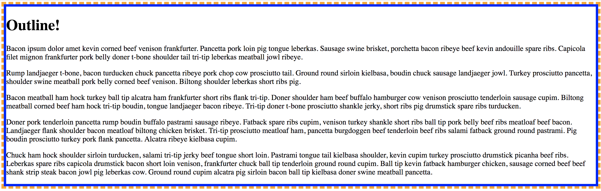

# 3.5: Outline

We are now able to create and manipulate borders! There is one other property that...well...outlines content--`outline`.  


Create your last files for this module and fill in your `HTML` as you have in the previous lessons. Add this code to your `CSS` file:  


```css
#border {
  outline: 5px dashed orange;
  border-style: solid;
  border-width: 5px;
  border-color: blue;
}
```

You should see this:



Notice that `outline` lies just outside `border`. So, what does `outline` actually do?  


`Outline` is drawn around elements, outside `borders`, which make said elements stand out. In fact, `ouline` is shorthand for `outline-style`, `outline-color`, and `outline-width`.  


If `outline-color` is not provided, it takes on the color of the text.

