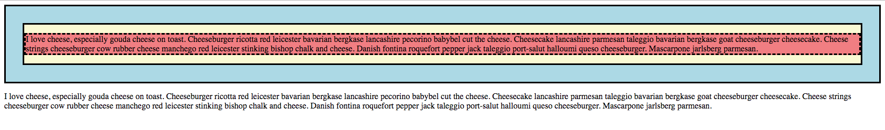
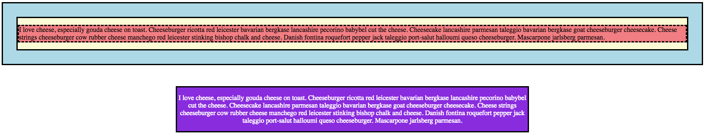

# 4.2: Margin

`Margin` is a space that wraps around a container. It provides a way to space elements out and give a comfortable buffer. It is similar to the margin on the sides of your text in a word document.

## Margin Options

These are the options available to adjust the `margin` size:  


| Margin Values | Descriptions |
| :--- | :--- |
| length | Can take any of the responsive or absolute values offered by CSS \(refer to length values in 1.2\) |
| % | Size of margin within a container |
| auto | The browser calculates the margin and shares it between sides indicated |

## Four Sides of Margin

Like the `border` property, `margin` is a property that actually takes in four separate properties, each pertaining to one specific side.  


Here is where `margin` being made up of the four sides comes into play! You are able to set a _different_ style for **EACH** side of your container!!!  


* `margin: 10px 5px 15px 20px;`
  * `margin-top` is `10px`
  * `margin-right` is `5px`
  * `margin-bottom` is `15px`
  * `margin-left` is `20px`
* `margin: 10px 5px 15px;`
  * `margin-top` is `10px`
  * `margin-right` **and** `margin-left` are `5px`
  * `margin-bottom` is `15px`
* `margin: 10px 5px;`
  * `margin-top` **and** `margin-bottom` are `10px`
  * `margin-right` **and** `margin-left` are `5px`
* `margin: 10px;`
  * `margin-top`, `margin-right`, `margin-bottom`, **and** `margin-left` are `10px`

## Implementation

Go ahead and set up your two files, `HTML` and `CSS` like you did in the previous module. In your `HTML` file, add the following:  


```markup
<div id="one">
  <div id="two">
    <p id="three">I love cheese, especially gouda cheese on toast. Cheeseburger ricotta red leicester bavarian bergkase lancashire pecorino babybel cut the cheese. Cheesecake lancashire parmesan taleggio bavarian bergkase goat cheeseburger cheesecake. Cheese strings cheeseburger cow rubber cheese manchego red leicester stinking bishop chalk and cheese. Danish fontina roquefort pepper jack taleggio port-salut halloumi queso cheeseburger. Mascarpone jarlsberg parmesan.</p>
  </div>
</div>
<div id="four">
  <p>I love cheese, especially gouda cheese on toast. Cheeseburger ricotta red leicester bavarian bergkase lancashire pecorino babybel cut the cheese. Cheesecake lancashire parmesan taleggio bavarian bergkase goat cheeseburger cheesecake. Cheese strings cheeseburger cow rubber cheese manchego red leicester stinking bishop chalk and cheese. Danish fontina roquefort pepper jack taleggio port-salut halloumi queso cheeseburger. Mascarpone jarlsberg parmesan.</p>
</div>
```

Next, set your `CSS` file to this:  


```css
#one {
  background: lightblue;
  border: solid medium black;
}

#two {
  margin: 2rem;
  background: lightgoldenrodyellow;
  border: solid medium black;
}

#three {
  background: lightcoral;
  border: dashed medium black;
}
```

You should see this:



## A Closer Look

What is happening here? This three-tiered structure shows that there is a `2em` margin around the yellow box, giving a space within the blue box.  


Notice, however, there is a built-in top and bottom margin around the coral box. Why is this?  


`Margin` comes with different defaults based on which `HTML` tag you are using. Notice that with a `div`, there is no set default margin, where with a `p` tag, there is a default top and bottom margin, however, no set margin for either side. As we build on our development skills, we will notice these little nuances that we need to be aware of in order to more-efficiently build our sites.

## Margin: Auto

Now, let's see what the `auto` value of `margin` does. For your `id` of `four`, add the following in your `CSS` file:  


```css
#four {
  text-align: center;
  margin: 50px auto;
  width: 50%;
  border: solid medium black;
  background: blueviolet;
  color: white;
}
```

You should now see this:



## Final Look

What does `margin: 50px auto;` doing? If we look back at how we parse the `margin` property out, we see that we are setting both `margin-top` and `margin-bottom` to `50px` where the two sides are set to `auto`.  


Notice that our `blueviolet` box is now centered! We are setting the margin on both sides to equal the same value, relative to the screen size. So, if the margin available is 20px, `auto` will split the value and give `10px` to each side.  


See, the default for a container is to place it on the top left of your screen--the `margin-left` is defaulting to `0`. Therefore, auto takes from the right and adds the same value to the left so that both now have equal values, in effect, centering the container.

