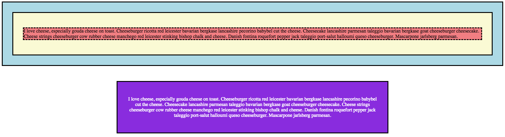

# 4.3: Padding

The property of `padding` resembles `margin` very closely. The difference is really only on which side of container you are effecting.  

Before we discuss this further, let's see what it is doing. Copy the code from the `margin` lesson \(4.2\) and paste it in your `HTML` and `CSS` files.  

In your `CSS` file, add `padding: 2rem;` to your `#two` and `#four` selectors. Save and run the code and you should see this:

## Margin vs. Padding

Now that we know `margin`, we know all of the options available for `padding`! It, like `margin` also can be broken up into four sides.  

So, if they are so similar, what is the difference? Look at this picture:

This is a good visual for `margin` and `padding`. Think of the box as your `border` and the items within is text. The packing peanuts are `padding` and the space around the box is `margin`.  

Margin allows you to add space around the container, similar to how we were able to center and push down our `blueviolet` box in our code. Notice, however, that the black border for our purple box now is farther from the white text. That space between the text and the border is padding.  

The use of `padding` allows us to create space within our containers, like in a `div`. This property thus allows us to create a little more comfortable space within our container without having to move it around and effect other elements of our site.

