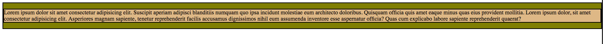
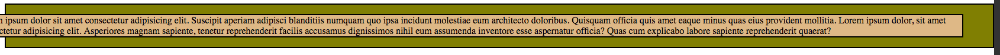
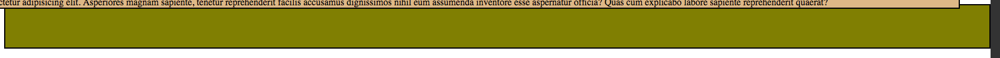
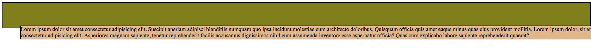

# 4.4: Edge Properties

Edge properties consist of `top`, `right`, `bottom`, and `left` properties. Each of these properties affect the one side of a container \(i.e. `right` affects the margin on the right of the container\).  


They are relatively easy to use; the catch is that _they need to be used in tandem with the_ `position` _property_.

## Edge Property Options

These are the options available to adjust the `top`, `right`, `bottom`, and `left` properties and how they react with `position`:  


|  | Absolute or Fixed | Relative | Sticky | Static |
| :--- | :--- | :--- | :--- | :--- |
| **top** | Sets the top edge of an element above/below its nearest parent container | Makes the element's top edge to move above/below its normal position | Behaves like its position is relative when the element is inside the screen; like fixed when it is outside the screen | Has no effect |
| **right** | Sets the right edge of an element right/left its nearest parent container | Makes the element's right edge to move right/left its normal position | Behaves like its position is relative when the element is inside the screen; like fixed when it is outside the screen | Has no effect |
| **bottom** | Sets the bottom edge of an element below/above its nearest parent container | Makes the element's bottom edge to move below/above its normal position | Behaves like its position is relative when the element is inside the screen; like fixed when it is outside the screen | Has no effect |
| **left** | Sets the left edge of an element left/right its nearest parent container | Makes the element's left edge to move left/right its normal position | Behaves like its position is relative when the element is inside the screen; like fixed when it is outside the screen | Has no effect |

## Implementation

Go ahead and set up your two files, `HTML` and `CSS` like you did in the previous module. In your `HTML` file, add the following:  


```markup
<div id="one">
  <p id="two">Lorem ipsum dolor sit amet consectetur adipisicing elit. Suscipit aperiam adipisci blanditiis numquam quo ipsa incidunt molestiae eum architecto doloribus. Quisquam officia quis amet eaque minus quas eius provident mollitia. Lorem ipsum dolor, sit amet consectetur adipisicing elit. Asperiores magnam sapiente, tenetur reprehenderit facilis accusamus dignissimos nihil eum assumenda inventore esse aspernatur officia? Quas cum explicabo labore sapiente reprehenderit quaerat?</p>
</div>
```

Next, set your `CSS` file to this:  


```css
#one {
  position: absolute;
  border: 2px solid black;
  background-color: olive;
}

#two {
  position: relative;
  border: 2px solid black;
  background-color: burlywood;
}
```

You will see this:



Now, add the property `right` and set the value to `50px` to your selector for your `id` of `two`. You will see this:



Notice that the `burlywood` box was simply pushed to the left. Now, add `bottom: 50px` to the same selector. This will be your outcome now:



See, you now are pushing the same box up and out of the screen window. Now, see what happens when you _add_ both `left: 50px` and `top: 50px` to your selector. You will see this:



What happened?? The `burlywood` box is now pushed to the right and bottom! Notice that `top` and `left` overrides `bottom` and `right`. They simply can't all effect the container all at once and notice that these edge properties are not squishing the contianer to allow for all to work properly.  


There are definite limitations to edge properties, but they certainly do provide a quick way to move a container. Just remember that they only work if `position` is used as well!

