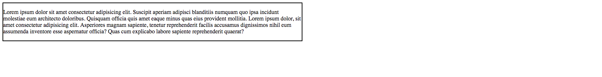
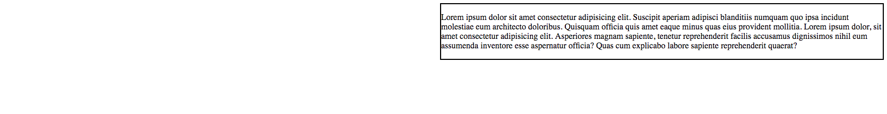

# 4.5: Float

`Float` allows us to slide a container either to the right, or to the left. This is particularly convenient when you want to push an element to the far right.  


In addition to directing a container to one end of your screen, or the other, it fills in that white space with other elements, auto-filling the space with content you might want side-by-side.

## Implementation

Go ahead and set up your two files, `HTML` and `CSS` like you did in the previous module. In your `HTML` file, add the following:  


```markup
<div id="one">
  <p>Lorem ipsum dolor sit amet consectetur adipisicing elit. Suscipit aperiam adipisci blanditiis numquam quo ipsa incidunt molestiae eum architecto doloribus. Quisquam officia quis amet eaque minus quas eius provident mollitia. Lorem ipsum dolor, sit amet consectetur adipisicing elit. Asperiores magnam sapiente, tenetur reprehenderit facilis accusamus dignissimos nihil eum assumenda inventore esse aspernatur officia? Quas cum explicabo labore sapiente reprehenderit quaerat?</p>
</div>
```

Next, set your `CSS` file to this:  


```css
#one {
  border: 2px solid black;
  width: 50%;
}
```

You will see this:



Now, add `float: left`. Notice that it doesn't do anything. The reason for this is that `left` is the default for `float`; remember, `CSS` defaults to placing containers top/left of the screen.  


Now, change `float` to `right`. You will see this:



See how this simply pushed the container to the right? Simple enough right?

