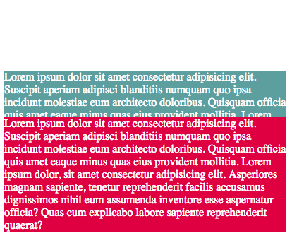
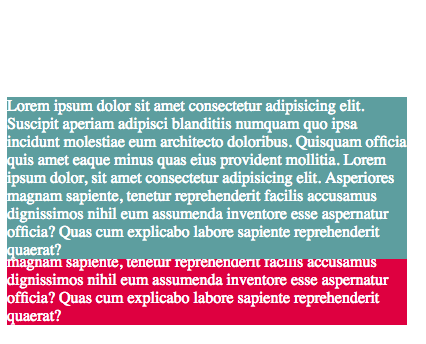

# 4.6: Z-Index

What on earth is `z-index`? Think of a graph that we used to draw in high school. The x-index is the horizontal line and the y-index is the vertical. `Z-index` brings in the 3D distance, layering elements on top or below another.  


However, like the edge properties \(4.4\), `z-index` works with the `position` property.

## Implementation

Go ahead and set up your two files, `HTML` and `CSS` like you did in the previous module. In your `HTML` file, add the following:  


```markup
<div>
  <p id="one">Lorem ipsum dolor sit amet consectetur adipisicing elit. Suscipit aperiam adipisci blanditiis numquam quo ipsa incidunt molestiae eum architecto doloribus. Quisquam officia quis amet eaque minus quas eius provident mollitia. Lorem ipsum dolor, sit amet consectetur adipisicing elit. Asperiores magnam sapiente, tenetur reprehenderit facilis accusamus dignissimos nihil eum assumenda inventore esse aspernatur officia? Quas cum explicabo labore sapiente reprehenderit quaerat?</p>
  <p id="two">Lorem ipsum dolor sit amet consectetur adipisicing elit. Suscipit aperiam adipisci blanditiis numquam quo ipsa incidunt molestiae eum architecto doloribus. Quisquam officia quis amet eaque minus quas eius provident mollitia. Lorem ipsum dolor, sit amet consectetur adipisicing elit. Asperiores magnam sapiente, tenetur reprehenderit facilis accusamus dignissimos nihil eum assumenda inventore esse aspernatur officia? Quas cum explicabo labore sapiente reprehenderit quaerat?</p>
</div>
```

Next, set your `CSS` file to this:  


```css
#one {
  position: relative;
  background: cadetblue;
  color: white;
  top: 7em;
  width: 25em;
}

#two {
  position: relative;
  background: crimson;
  color: white;
  width: 25em;
}
```

You will see this:



If you set the `z-index` to `auto` in `#one`, you will see the same thing. The reason for this is that `auto` is default for `z-index`.  


However, if you set the `z-index` to `1`, you will see this:



If the default plane for `z-index` is at `0`, anything set in positive integers \(1, 2, 3, etc.\), that container will lay on the top; if the numbers go negative, it falls below.

