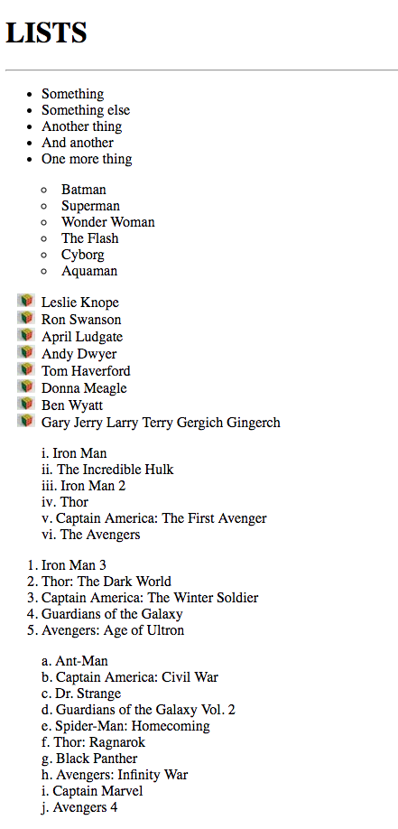

# 5.1: List Style

Bullet points or numbers? Alpha-numerics or Roman numerals? So many options! `List-style` allows us to customize the bullet points and numbers with our lists.  


`List-style` is actually a compilation of three properties: `list-style-type`, `list-style-position`, and `list-style-image`. Where `list-style-type` changes the type of bullet point or number you want to use, and `list-style-position` pushes the bullet point either inside or outside the list item, `list-style-image` allows you to replace the bullet point with an image!

## List-Style Options

These are the options available to adjust both the `list-style-position` and `list-style-type`:  


| List-Style-Position Values | Descriptions |
| :--- | :--- |
| outside | Marker will be outside the list item \(**this is the default**\) |
| inside | Marker will be inside the list item |

| List-Style-Type Values | Descriptions |
| :--- | :--- |
| disc | Marker is a filled circle \(**this is the default**\) |
| armenian | Marker is traditional Armenian numbering |
| circle | Marker is a hollow circle |
| cjk-ideographic | Marker is plain ideographic numbers |
| decimal | Marker is a number |
| decimal-leading-zero | Marker is a number with a 0 in front \(i.e. 01, 02, 03, etc.\) |
| georgian | Marker is traditional Georgian numbering |
| hebrew | Marker is traditional Hebrew numbering |
| hiragana | Marker is traditional Hiragana numbering |
| hiragana-iroha | Marker is traditional Hiragana iroha numbering |
| katakana | Marker is traditional Katakana numbering |
| katakana-iroha | Marker is traditional Katakana iroha numbering |
| lower-alpha | Marker is lower-case letters |
| lower-greek | Marker is lower-case Greek letters |
| lower-latin | Marker is lower-case Latin letters |
| lower-roman | Marker is lower-case Roman letters |
| none | No marker is shown |
| square | Marker is a square |
| upper-alpha | Marker is upper-case letters |
| upper-greek | Marker is upper-case Greek letters |
| upper-latin | Marker is upper-case Latin letters |
| upper-roman | Marker is upper-case Roman letters |

## Implementation

Go ahead and set up your two files, `HTML` and `CSS` like you did in the previous module. In your `HTML` file, add the following:  


```markup
<div>
  <h1>LISTS</h1>
  <hr>
  <ul class="a">
    <li>Something</li>
    <li>Something else</li>
    <li>Another thing</li>
    <li>And another</li>
    <li>One more thing</li>
  </ul>
  <ul class="b">
    <li>Batman</li>
    <li>Superman</li>
    <li>Wonder Woman</li>
    <li>The Flash</li>
    <li>Cyborg</li>
    <li>Aquaman</li>
  </ul>
  <ul class="c">
    <li>Leslie Knope</li>
    <li>Ron Swanson</li>
    <li>April Ludgate</li>
    <li>Andy Dwyer</li>
    <li>Tom Haverford</li>
    <li>Donna Meagle</li>
    <li>Ben Wyatt</li>
    <li>Gary Jerry Larry Terry Gergich Gingerch</li>
  </ul>
  <ol class="d">
    <li>Iron Man</li>
    <li>The Incredible Hulk</li>
    <li>Iron Man 2</li>
    <li>Thor</li>
    <li>Captain America: The First Avenger</li>
    <li>The Avengers</li>
  </ol>
  <ol class="e">
    <li>Iron Man 3</li>
    <li>Thor: The Dark World</li>
    <li>Captain America: The Winter Soldier</li>
    <li>Guardians of the Galaxy</li>
    <li>Avengers: Age of Ultron</li>
  </ol>
  <ol class="f">
    <li>Ant-Man</li>
    <li>Captain America: Civil War</li>
    <li>Dr. Strange</li>
    <li>Guardians of the Galaxy Vol. 2</li>
    <li>Spider-Man: Homecoming</li>
    <li>Thor: Ragnarok</li>
    <li>Black Panther</li>
    <li>Avengers: Infinity War</li>
    <li>Captain Marvel</li>
    <li>Avengers 4</li>
  </ol>
</div>
```

Next, set your `CSS` file to this:  


```css
.b {
  list-style: circle inside;
}

.c {
  list-style: square outside url('./assets/cube.jpg');
}

.d {
  list-style: lower-roman inside;
}

.e {
  list-style: decimal outside;
}

.f {
  list-style: lower-alpha inside;
}
```

You should see this:



## Relative Pathing

\*The picture, `cube.jpg`, comes from [Pexels.com](https://www.pexels.com/photo/brain-color-colorful-cube-19677/), an open-source, free, site that offers many high-quality pictures without fear of copyright. I saved the picture in our newly-created `assets` folder and set the `width` to `20px`.  


Notice, however that the way we access it is `./assets/cube.jpg`; rather than starting with `C:/` or `User/`. How does this work?  


First, computers access files, like an image, through a path that points to its location. In a local setting \(like on your laptop or whatever\), the computer naturally will start at the root folder, which is the `C` folder \(or `User` folder for a Mac\). And then, as it works its way through the structure of your computer, it will separate each level with a `/`; in effect, making a link that directly points to that file.  


The problem with this tactic is that no one else \(hopefully\) can see inside your computer. So, when you share your code or deploy your site, no one will then have access to those files. The work around is with `relative pathing`!  


Relative pathing links to files based on the location from where you are calling it. So, let's see what we are dealing with. Here is the structure that we have been creating in this module:  


```text
    └── 5-css-lists&tables
        └── 5.1-list-style.css
        └── 5.1-list-style.html
        └── 5.2-empty-cells.css
        └── 5.2-empty-cells.html
        └── assets
            └── cube.jpg
```

Notice that the `assets` folder is at the same level as our four files? If you were simply to look inside the `5-css-lists&tables` folder, you would see 2 `HTML` files, 2 `CSS` files, and the `assets` folder. Then, if you look inside your `assets` folder, you would see our picture, `cube.jpg`.  


So, if I am in my `5.1-list-style.css` file, I need to get into my `assets` folder. If I use a `./`, I am telling the computer to look inside the folder I am already in \(if I need to go up a level, I would use `../`\). After the `./`, all I need to do is name the folder I want to go into \(`assets`\) and then name the file I want to grab `cube.jpg`.

