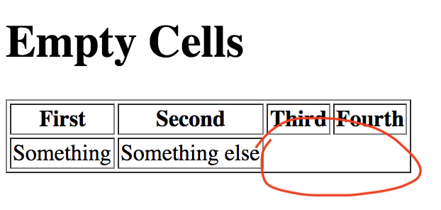

# 5.2: Empty Cells

The `empty-cells` property \(and yes, it is plural--`cells`, _not_ `cell`\) allows us to hide the cells of a table if they are not filled. This allows the developer to show only the content he/she wants and prevents the distraction of empty table cells.

## Implementation

Go ahead and set up your two files, `HTML` and `CSS` like you did in the previous module. In your `HTML` file, add the following:  


```markup
<div>
  <h1>Empty Cells</h1>
  <table class="example1" border="1">
    <thead>
      <tr>
        <th>First</th>
        <th>Second</th>
        <th>Third</th>
        <th>Fourth</th>
      </tr>
    </thead>
    <tbody>
      <tr>
        <td>Something</td>
        <td>Something else</td>
      </tr>
    </tbody>
  </table>
</div>
```

Next, set your `CSS` file where the class of `example1` has the property of `empty-cells` set to `hide`.

You should see this:



Notice that the space is still there, but the cells and their individual borders are not.

