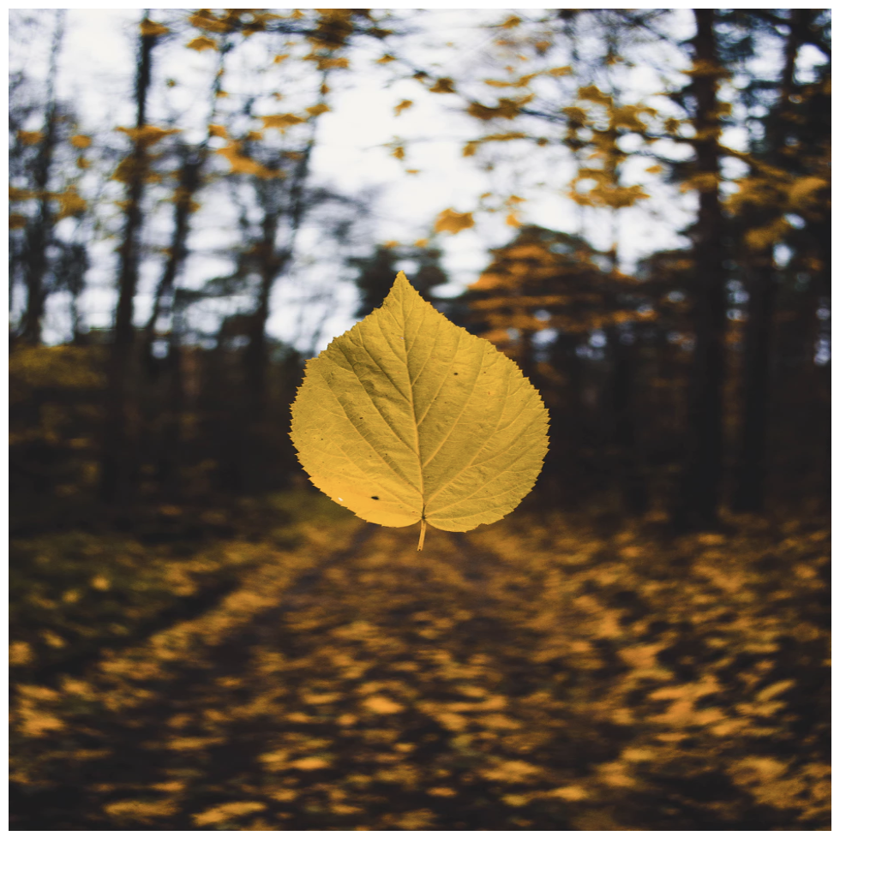

# 6.1: Height & Width

Imagine using pictures without the tools to adjust the size or shape once they are in your code. Bringing them in as they originally are would likely distort the layout and desired look of your site. How, then, can we change the picture once we have brought it in?  

With the help of `height` and `width`, we can change the size and shape of our pictures as we see fit!  

And, like many other properties in CSS, `height` and `width` can be used with other elements beyond just images. Try it out on other features; experiement!

## Height and Width Options

Like many other properties in CSS, `height` and `width` take in the different kinds of lenght sizing \(i.e. `px`, `em`, `%`, etc.\).  

One thing to note: both of these properties do not include `padding`, `border`, and `margin`! So, when you adjust your images, be aware that you will need to take these other spaces into consideration.  

### More on Height

`Height` has a few more options associated with it.  

Another value you can set, beyond that of numeric or percentage values, is `auto`. This value will automatically adjust the element's height to allow it to be display correctly on the screen.  

Furthermore, if your image does not fit the container that you have set for it, it will overflow \(this is why images are occasionally difficult/irritating to work with\). You can, however, use the `overflow` property \(7.4\) to handle how it is to spill outside of your container.

## Implementation

Go ahead and set up your two files, `HTML` and `CSS` like you did in the previous module. Now, create an `img` tag inside your `HTML` and set the `src` to `https://images.unsplash.com/photo-1478296046035-d4fc77bec472?ixlib=rb-0.3.5&ixid=eyJhcHBfaWQiOjEyMDd9&s=1765a0f3f5ff7cca81cb29b1372e932f&auto=format&fit=crop&w=934&q=80`. In addition to the `src`, give your `img` tag an `id` of `picture`.  

We are borrowing the picture in this module from [Unsplash.com](https://unsplash.com/photos/vrY49w_-Bmc), another free, open-source, high-quality, photo site that developers can easily grab content from and use worry-free in their applications.  

If you run your code, you should see this:

Next, in your `CSS` file, set your `id` of `picture` as the selector and give it the `height` of `30em`, as well as the `width` of `30em`.  

You should see this:

The screenshots don't quite do it justice. What you should, however, notice is that the image, without the styling of our CSS, is large and rectangular in a portrait \(taller than wide\) arrangement. You might have to scroll up and down to see the entire image. After you apply the CSS, you should now see a perfectly square picture that is much smaller than before.  

In addition to making it square, however, you might notice that the image is now squished a little. This is the catch with using both `height` and `width`; you distort the shape of your image and thus stretch or squish it to fit your new shape. It is, therefore, best to only use one of the properties when adjusting images. This might, however, require you to adjust the shape/resolution before you bring it into your code.

## Max and Min

`Max-height`, `max-width`, `min-height`, and `min-width` create a stopping point where the image will not go beyond that particular value set. If, for instance, you have a value set for `min-height`, the image will get no smaller than that size you designated. If the image is larger than the `min-height` value, this property will have no effect.  

When implemented, the mins and maxes override `height` and `width`.  

This is a great tool for setting a size limit for your image or container!

