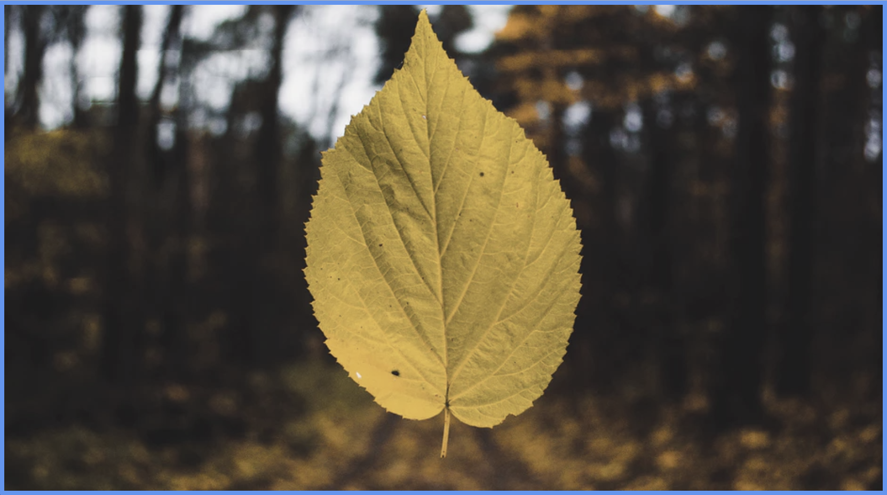
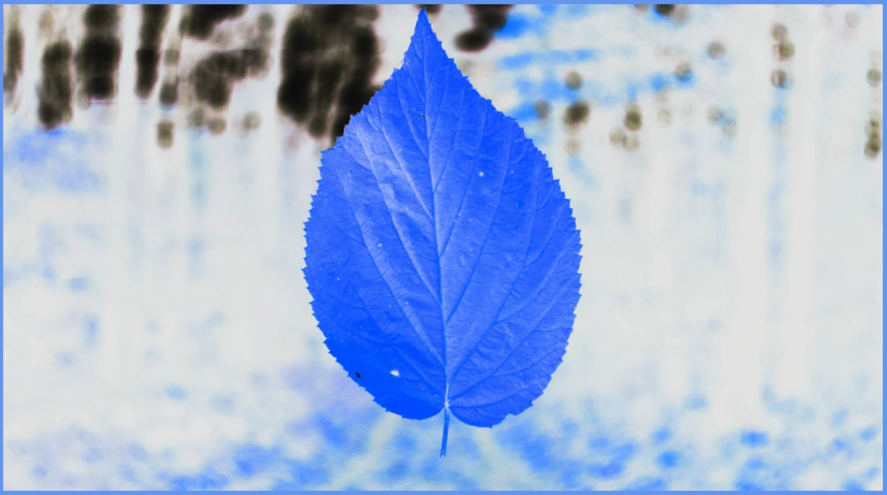

# 6.3: Filter

Once we properly size and contain our picutres, we can now add filters to stylize our images. The `filter` property allows us to customize our pictures.

## Filter Options

However, unlike `background-size`, `object-fit` only takes specific values, rather than numeric or percentage, etc.  


| Object-Fit Values | Descriptions |
| :--- | :--- |
| none | Specifies no effect \(**this is the default**\) |
| blur\(px\) | Applies blur effect; the greater the value, the greater the blur |
| brightness\(%\) | Adjusts the brightness of the image; 0% = black, 100% = default, &gt; 100% = brighter |
| contrast\(%\) | Adjusts the contrast of the image; 0% = black, 100% = default, &gt; 100% = less contrast |
| drop-shadow\(h-shadow v-shadow blur spread color\) | Applies a drop shadow to the image.  **Possible values:** \[1\] _h-shadow_: specifies a pixel value for the horizontal shadow \(**required**\); \[2\] _v-shadow_: specifies a pixel value for the vertical shadow \(**required**\); \[3\] _blur_: adds a blur effect to the shadow \(must be in px\); \[4\] _spread_: grows/shrinks shadow \(must be in px\); \[5\] _color_: adds color to the shadow; \[6\] _filter_: similar to the `box-shadow` property |
| grayscale\(%\) | Converts the image to grayscale; 0% = original, 100% = completely grey |
| hue-rotate\(deg\) | Applies a hue rotation to create negative colors |
| invert\(%\) | Inverts the image; 0% = default; 100% = completely inverted |
| opacity\(%\) | Adds transparency to image; 0% = transparent; 100% = default |
| saturate\(%\) | Saturates the image; 0% = unsaturated; 100% = is default; &gt; 100% = super-saturated |
| sepia\(%\) | Converts image to sepia; 0% = default; 100% = completely sepia |
| url\(\) | Takes location of XML file that specifies SVG filter |

## Implementation

Create your two `HTML` and `CSS` files and copy/paste the content from the last lesson into your respective locations. Now, add a `background` of `conflowerblue` and change the `height` and `width` a bit:  


```css
body {
  background: cornflowerblue;
}
#picture {
  height: 98vh;
  width: 98vw;
  object-fit: cover;
}
```

Now, add `filter` of `grayscale(50%)`.

If you run your code, you should see this:



Change the value of `filter` to `blur(10px)`.

You should now see this:


Change the value of `filter` to `opacity(50%)`.

You should now see this:


And now, change the value of `filter` to `invert(100%)`.

You should now see this:



