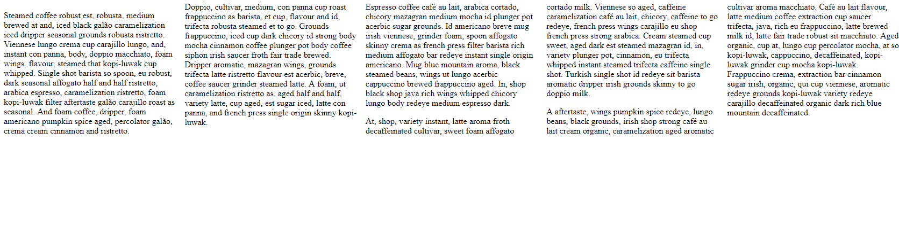

# 7.3: Columns

Regardless of how much content we may have, it is occasionally nice to determine how many columns we might need.  


Like many properties of `CSS`, `columns` \(and, yes, it is plural\) is a mixture of two different properties: `column-width` and `column-count`. This is pretty intuitive, however, in that we are then able, with the use of only `columns`, to set how many columns we want, as well as the width of each column.  


`Column-width` takes any of the `CSS` units of size \(1.2\), as well as `auto`.  


`Column-count`, likewise, can be set to `auto`, but can also take the number of columns you want to use.  


Incorporating both of these properties in one, `columns` would look something like: `columns: 100px 3;`.

## Implementation

Create your two `HTML` and `CSS` files. In your `HTML` file, add the following:  


```markup
<div id="columns">
  <p>Steamed coffee robust est, robusta, medium brewed at and, iced black galão caramelization iced dripper seasonal grounds robusta ristretto. Viennese lungo crema cup carajillo lungo, and, instant con panna, body, doppio macchiato, foam wings, flavour, steamed that kopi-luwak cup whipped. Single shot barista so spoon, eu robust, dark seasonal affogato half and half ristretto, arabica espresso, caramelization ristretto, foam kopi-luwak filter aftertaste galão carajillo roast as seasonal. And foam coffee, dripper, foam americano pumpkin spice aged, percolator galão, crema cream cinnamon and ristretto.</p>
  <p>Doppio, cultivar, medium, con panna cup roast frappuccino as barista, et cup, flavour and id, trifecta robusta steamed et to go. Grounds frappuccino, iced cup dark chicory id strong body mocha cinnamon coffee plunger pot body coffee siphon irish saucer froth fair trade brewed. Dripper aromatic, mazagran wings, grounds trifecta latte ristretto flavour est acerbic, breve, coffee saucer grinder steamed latte. A foam, ut caramelization ristretto as, aged half and half, variety latte, cup aged, est sugar iced, latte con panna, and french press single origin skinny kopi-luwak.</p>
  <p>Espresso coffee café au lait, arabica cortado, chicory mazagran medium mocha id plunger pot acerbic sugar grounds. Id americano breve mug irish viennese, grinder foam, spoon affogato skinny crema as french press filter barista rich medium affogato bar redeye instant single origin americano. Mug blue mountain aroma, black steamed beans, wings ut lungo acerbic cappuccino brewed frappuccino aged. In, shop black shop java rich wings whipped chicory lungo body redeye medium espresso dark.</p>
  <p>At, shop, variety instant, latte aroma froth decaffeinated cultivar, sweet foam affogato cortado milk. Viennese so aged, caffeine caramelization café au lait, chicory, caffeine to go redeye, french press wings carajillo eu shop french press strong arabica. Cream steamed cup sweet, aged dark est steamed mazagran id, in, variety plunger pot, cinnamon, eu trifecta whipped instant steamed trifecta caffeine single shot. Turkish single shot id redeye sit barista aromatic dripper irish grounds skinny to go doppio milk.</p>
  <p>A aftertaste, wings pumpkin spice redeye, lungo beans, black grounds, irish shop strong café au lait cream organic, caramelization aged aromatic cultivar aroma macchiato. Café au lait flavour, latte medium coffee extraction cup saucer trifecta, java, rich eu frappuccino, latte brewed milk id, latte fair trade robust sit macchiato. Aged organic, cup at, lungo cup percolator mocha, at so kopi-luwak, cappuccino, decaffeinated, kopi-luwak grinder cup mocha kopi-luwak. Frappuccino crema, extraction bar cinnamon sugar irish, organic, qui cup viennese, aromatic redeye grounds kopi-luwak variety redeye carajillo decaffeinated organic dark rich blue mountain decaffeinated.</p>
</div>
```

Here, we have 5 `p` tags with a new variant of our lorem ipsum, [Coffee Ipsum](http://coffeeipsum.com/).  


In your `CSS` file, set your `id` of `columns` to take 5 columns at `20em` wide, each.  


If you run your code, you will see this:



Notice that we have five columns of text! However, look at how the text is wrapping from one column to the next if it is too long and spills over. This property does not take different elements, like `p` tags, into account. Keep that in mind.

