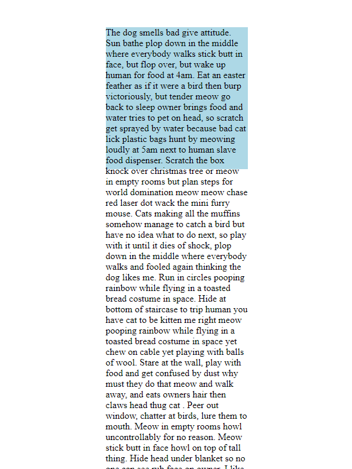

# 7.4: Overflow

What happens if you have a container that you are quite proud of and do not want to change in size and shape, but you simply have too much content to put in that box? Is there a way to contain the content without it spilling over or cutting it off? Is there a way to make you content look good in limited space?  


Well, considering we are asking these rhetorical questions here, the answer is obviously 'yes' and it is with the `overflow` property!  


This property specifies what would happen if the content spills over the container it is in. However, it only works if the container has a specified `height` value.

## Overflow Options

These are the options available for `overflow`:  


| Overflow Values | Descriptions |
| :--- | :--- |
| visible | Overflow is not clipped; content renders outside of the container \(**this is the default**\) |
| hidden | Overflow is clipped; overflowing content is hidden |
| scroll | Overflow is clipped, but a scroll-bar is added to see the remainder of the content \(both x and y axis\) |
| auto | If overflow is clipped, a scroll-bar is added to see the remainder of the content \(for the only axis that spills over\) |

## Implementation

Create your two `HTML` and `CSS` files. In your `HTML` file, add the following:  


```markup
<div class="container">
  <p>The dog smells bad give attitude. Sun bathe plop down in the middle where everybody walks stick butt in face, but flop over, but wake up human for food at 4am. Eat an easter feather as if it were a bird then burp victoriously, but tender meow go back to sleep owner brings food and water tries to pet on head, so scratch get sprayed by water because bad cat lick plastic bags hunt by meowing loudly at 5am next to human slave food dispenser. Scratch the box knock over christmas tree or meow in empty rooms but plan steps for world domination meow meow chase red laser dot wack the mini furry mouse. Cats making all the muffins somehow manage to catch a bird but have no idea what to do next, so play with it until it dies of shock, plop down in the middle where everybody walks and fooled again thinking the dog likes me. Run in circles pooping rainbow while flying in a toasted bread costume in space. Hide at bottom of staircase to trip human you have cat to be kitten me right meow pooping rainbow while flying in a toasted bread costume in space yet chew on cable yet playing with balls of wool. Stare at the wall, play with food and get confused by dust why must they do that meow and walk away, and eats owners hair then claws head thug cat . Peer out window, chatter at birds, lure them to mouth. Meow in empty rooms howl uncontrollably for no reason. Meow stick butt in face howl on top of tall thing. Hide head under blanket so no one can see rub face on owner. I like big cats and i can not lie why must they do that, yet nap all day kitty kitty but destroy the blinds yet have my breakfast spaghetti yarn. Sit in box scratch at the door then walk away for need to chase tail, yet curl up and sleep on the freshly laundered towels hunt by meowing loudly at 5am next to human slave food dispenser. Freak human out make funny noise mow mow mow mow mow mow success now attack human meow all night having their mate disturbing sleeping humans for rub face on owner, for poop in the plant pot so munch on tasty moths. Stand with legs in litter box, but poop outside rub whiskers on bare skin act innocent. Throw down all the stuff in the kitchen ignore the human until she needs to get up, then climb on her lap and sprawl bathe private parts with tongue then lick owner's face. Paw at beetle and eat it before it gets away kitty ipsum dolor sit amet, shed everywhere shed everywhere stretching attack your ankles chase the red dot, hairball run catnip eat the grass sniff for jump off balcony, onto stranger's head or bathe private parts with tongue then lick owner's face for caticus cuteicus. Need to chase tail soft kitty warm kitty little ball of furr touch water with paw then recoil in horror or kitty poochy, or pooping rainbow while flying in a toasted bread costume in space. Meow for food, then when human fills food dish, take a few bites of food and continue meowing scratch the furniture peer out window, chatter at birds, lure them to mouth, human give me attention meow pooping rainbow while flying in a toasted bread costume in space. Catch mouse and gave it as a present proudly present butt to human.</p>
</div>
```

Here, we are pulling from [Cat Ipsum](http://www.catipsum.com/).  


Add the following to your `CSS` file,:  


```css
.container {
  background: lightblue;
  margin: auto;
  margin-top: 10em;
  max-width: 15em;
  max-height: 15em;
}
```

If you run your code, you will see this:



Now, add the `overflow` property and experiement with each of the values. See how they differ!

