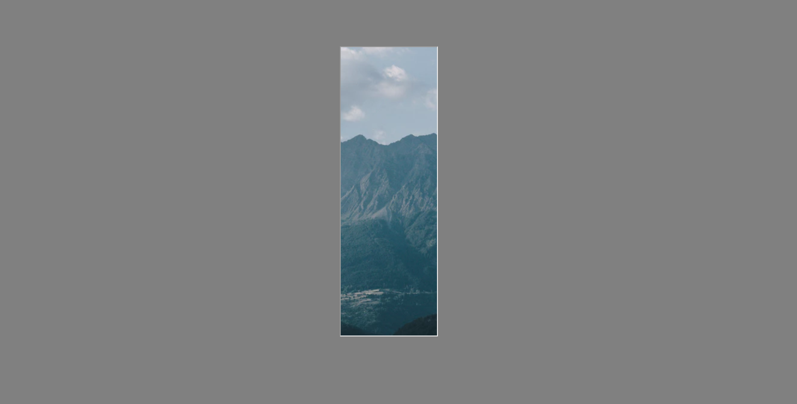
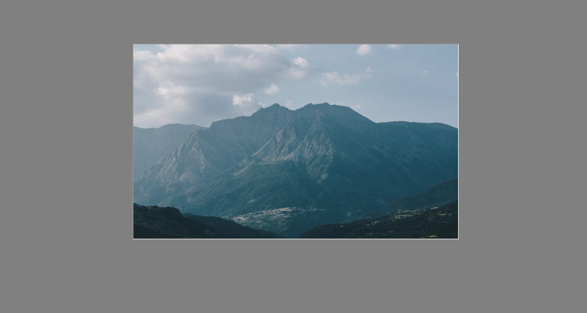
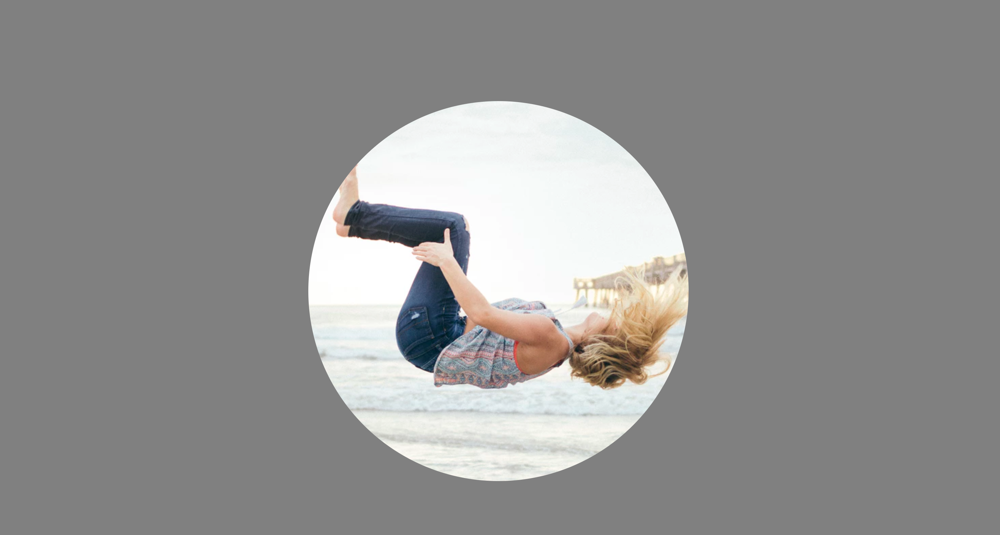

# 7.7: Transform & Transition

Here, we getting into animation using `CSS`! We have come a long way and, believe it or not, all of these skills that we have learned will help create productive and interactive sites.  


Now, we are getting to where we will be able to animate features--without the help of JavaScript!  


Both `transform` and `transition` allow us to do this. But let's look at them, one at a time.

## Transform

Let's first start with the `transform` property.  


This property allows us to apply transformation to an element, both 2D and 3D. We can `rotate`, `scale`, `move`, `skew`, etc.

### Transform Options

These are the options available for `transform`:  


| Transform Values | Descriptions |
| :--- | :--- |
| none | Gives no transformation \(**this is the default**\) |
| matrix\(n,n,n,n,n,n\) | Gives a 2D transformation, using a matrix of 6 values |
| matrix3d\(n,n,n,n,n,n,n,n,n,n,n,n,n,n,n,n\) | Gives a 3D transformation, using a matrix of 16 values |
| translate\(x,y\) | Gives a 2D translation \(movement\) |
| translate3d\(x,y,z\) | Gives a 3D translation |
| translateX\(x\) | Moves the element along the x-axis |
| translateY\(y\) | Moves the element along the y-axis |
| translateZ\(z\) | Moves the element along the z-axis \(3D\) |
| scale\(x,y\) | Scales an element in 2D \(grow/shrink\) |
| scale3d\(x,y,z\) | Scales an element in 3D |
| scaleX\(x\) | Scales along the x-axis |
| scaleY\(y\) | Scales along the y-axis |
| sclaeZ\(z\) | Scales along the z-axis \(3D\) |
| rotate\(deg\) | Rotates an element |
| rotate3d\(x,y,z,deg\) | Rotates an element in 3D |
| rotateX\(deg\) | Rotates an element along the x-axis |
| rotateY\(deg\) | Rotates an element along the y-axis |
| rotateZ\(deg\) | Rotates an element along the z-axis \(3D\) |
| skew\(x-deg,y-deg\) | Skews an element |
| skewX\(deg\) | Skews an element along the x-axis |
| skewY\(deg\) | Skews an element along the y-axis |
| perspective\(n\) | Gives the perspective for a 3D transformed element |

## Transition

Next, let's look at the `transition` property.  


This property allows us to actually create animation. Like many other properties, `transform` is actually a combination of 4 separate properties, `transition-property`, `transition-duration`, `transition-time-function`, and `transition-delay`.

### Transition-Property

`Transition-property` specifies the name of the property where you want the effect to take place; it usually occurs when a user hovers over that element.  


The available values for this property are: `none`, `all` \(each effecting either none or all, respectively, of you elements\), and a specific property you want to affect \(i.e `width`, `height`, etc.\).

### Transition-Duration

The `transition-duration` property defines how how long you want the animation to take effect--specifically, how long to get to the finished style. Its available value is time in seconds \(`s`\) or milliseconds \(`ms`\).

### Transition-Timing-Function

This property specifies the speed curve of the effect \(i.e. start slow, then go fast, then slow down at the end, etc.\). It allows us to change the speed during the event itself without having to specify or parse out our animation.  


Here are the options available for `transition-timing-function`:  


| Transition-Timing-Function Values | Descriptions |
| :--- | :--- |
| ease | Specifies a transition effect with a slow start, then fast, then end slow again \(**this is the default**\) |
| linear | Specifies a transition effect with the same speed from start to finish |
| ease-in | Specifies a transition effect with a slow start |
| ease-out | Specifies a transition effect with a slow end |
| ease-in-out | Specifies a transition effect with a slow start and end |
| step-start | Equivalent to steps\(1,start\) |
| step-end | Equivalent to steps\(1,end\) |
| steps\(int,start/end\) | Specifies a stepping function, with 2 parameters; first, specifies the number of intervals in the function \(must be &gt;= 0\), second, specifies the value of `start` or `end`, which states where the effect takes place |
| cubic-bezier\(n,n,n,n\) | Allows one to define their own values in the proper function |

### Transition-Delay

The `transition-delay` property specifies when the transition effect will start, where the value is in time \(similar to `transition-duration`\).

### Transition All Together

When combining all of these properties into the one, `transition`, it would look something like this: `transition: width 0.35s ease-in-out;`.

## Implementation

Addittedly, this is a lot. But clarity will come with working with these two properties.  


Create your `HTML` and `CSS` files, as per usual. In the `HTML`, add two `divs`, one with the `class` of `stretch`, and the other with a `class` of `rotate`.  


The first example will incorporate ONLY `transition`.&lt;br

In your `CSS` file, set the background of the whole page to `grey`.  


Next, set the `stretch` class to have the following:  


```css
background: url("https://images.unsplash.com/photo-1511547876233-3710a28eb30a?ixlib=rb-0.3.5&ixid=eyJhcHBfaWQiOjEyMDd9&s=22f767f18b0b0f11a5a1b6f3926cbcd3&auto=format&fit=crop&w=1000&q=80") center center;
border: inset;
width: 10em;
height: 30em;
margin: auto;
margin-top: 10em;
```

Next, below your code in your `CSS` file, add a `hover` feature for your `stretch` class and add the following:  


```css
cursor: pointer;
width: 50em;
```

When you run the code, you will will this:



And, when you hover over it, it will suddenly get wider and reveal the whole picture! But it is so abrupt. So how do we...transition?...from one size to the next in a nice, animated, slide?  




Now, add a `transition` to your `stretch` class that expands the picture over the course of 3 seconds in an `ease-in-out` pace. Try it out yourself before we move on.  


Next example! This will appear right below your expanding picture.  


In your `CSS` file, add the following under a selector for your `rotate` class:  


```css
 background: url("https://images.unsplash.com/photo-1476937619554-0f08b179a10c?ixlib=rb-0.3.5&s=84a64edb88d90f16c85237e9d4494c75&auto=format&fit=crop&w=1974&q=80") center center;
border-radius: 100%;
width: 35em;
height: 35em;
margin: auto;
margin-top: 10em;
margin-bottom: 10em;
```

Now, add a `hover` feature to the class and set the cursor to `pointer`.  


If you run the code and scroll down a bit, you should see this:



Notice, however, that when you hover over it, the cursor simply changes to the pointer hand, but nothing happens to the picture.  


### Try It Out Yourself!

On hover, have the picture rotate three times over the course of 5 seconds in an `ease-in` pace.  


When that is done, notice that when you move your cursor away from the picture, it spins back the other way as though it was wound by a spring.

### How Did You Do?

With these two, you might have noticed that you had to come up with the appropriate code yourself. Let's talk about what you might have added to make it work as per the instructions.  


For the `stretch` example, you might have added something like this inside the `.stretch` selector: `transition: width 3s ease-in-out;`.  


This would have had the picture expand on hover.  


For the `.rotate` example, you might have added two things: first, in the `.rotate` selector, you might have added `transition: transform 5s ease-in;`. This would have linked the animation to a transform. Said transfrom would then have been added to your `.rotate:hover` selector, looking something like this: `transform: rotate(1080deg);`.  


With adding these two, you have seen the second picture spin when you hover over it.  


If this made no sense at all, try to experiment with these two properties until they do! The best way to wrap your head around these properties is to work with them.

