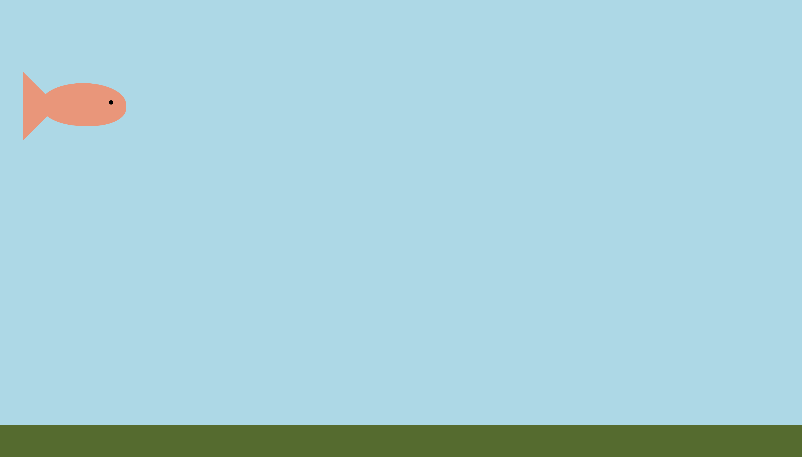
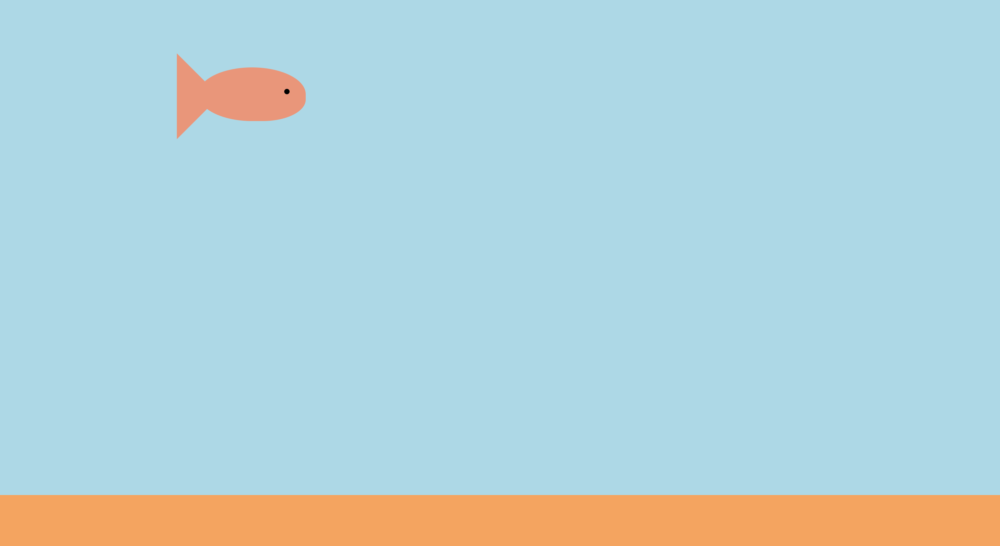
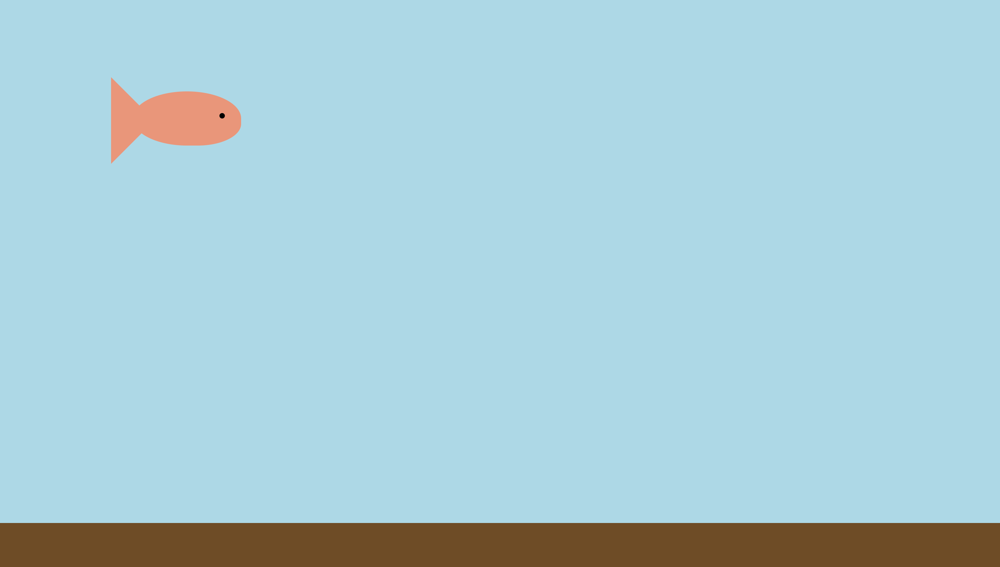

# 7.8: @ Rule & CSS Variables

What is an `@rule`? `CSS` comes with some advanced logic that can be differentiated with the "@" sign. There are a number of @rules; we will look at three of them in this lesson: `@media`, `@import`, @keyframes\`.

## @Keyframes

Remember how in the last lesson, we looked at CSS animation with `transform` and `transition`? These allowed up to do _temporary_ animation that relied on a specific act by the user \(like hovering over the element\).  


`@keyframes` allows us to add animation that loops a given duration, or even infinitly!  


Furthermore, this property works in tandum with another, `animation`.

### Animation

`Animation`, like a number of other properties, is a combination of many properties. There is how `animation` is broken up:  


| Animation Subset | Descriptions |
| :--- | :--- |
| animation-name | Gives the name of the animation that the keyframe can bind to |
| animation-duration | Designates how many seconds/milliseconds an animation takes to complete |
| animation-timing-function | Designates the pace of the animation |
| animation-delay | Determines if a delay is set before the animation begins |
| animation-iteration-count | Designates how many times an animation should be played |
| animation-direction | Specifies whether or not the animation should be played in reverse on alternating cycles |
| animation-fill-mode | Specifies what values are applied by the animation outside the executed time |
| animation-play-state | Specifies whether the animation is paused or running |

### @Keyframes Working With Animation

How do these two features work toether, however? Thanks to `animation-name`, we are able to label are particular animation. That name is then referred when creating the `@keyframe` selector.

### Quick Aside

It might be important for clarity purposes to mention that the @ Rules are actually `selectors` within `CSS`; not `properties`. Much of what this book has covered thus far has been properties with their corresponding values; these are selectors, meaning that they go _before_ the curly braces \(`{}`\).

## Implementation

Let's get into it! As per usual, create your `HTML` and `CSS` files \(in the `CSS` file, add a number 1 at the end of the name =&gt; i.e. `@rule&Variables1.css`\).  


For the `HTML` file, add the following within the `body` tag:  


```markup
<div class="fish">
  <div id="eye"></div>
  <div id="tail"></div>
</div>
<div class="sand"></div>
```

Now, add the following to the `CSS` file:  


```css
body {
  background-color: lightblue;
}

.fish {
  background: darksalmon;
  width: 10em;
  height: 5em;
  border-radius: 100% 100% 80% 100%; 
  margin-top: 10em;
  position: absolute;
  animation: swim 5s infinite;
  left: 5vw;
}

#eye {
  background: black;
  border-radius: 100%;
  width: .5em;
  height: .5em;
  position: relative;
  left: 8em;
  top: 2em;
}

#tail {
  width: 0;
  height: 0;
  position: relative;
  border-top: 4em solid transparent;
  border-bottom: 4em solid transparent;
  border-left: 4em solid darksalmon;
  left: -2em;
  top: -1.8em;
}

.sand {
  background: darkolivegreen;
  position: absolute;
  bottom: 0;
  left: 0;
  width: 100vw;
  height: 10vh;
}
```

When you run the code, you will see this:



What a nice little fish in the ocean! But it is not moving! Let's change that.  


Inside the `fish` class, add the `animation`. Give it the `animation-name` of `swim`, give it the `animation-duration` of 5 seconds, and give it the `animation-iteration-count` of `infinite`, this way the fish will swim forever!  


Next, create an `@keyframes` selector, pulling in the `animation-name` and set it to go from the left to the right of the screen.  


**Give it a try before you just copy the code in.**  


You should see something like this:  


```css
body {
  background-color: lightblue;
}

.fish {
  background: darksalmon;
  width: 10em;
  height: 5em;
  border-radius: 100% 100% 80% 100%; 
  margin-top: 10em;
  position: absolute;
  animation: swim 5s infinite; /* New code here */
  /* left: 5vw; You can remove this property => it is no longer needed */
}

...

/* Add new code below vvv */
@keyframes swim {
  from {left: -10vw;}
  to {left: 110vw;}
}
```

Now if you run the code, you will see the fish swimming across the page and, soon, repeating it trek across your screen over and over again!

### Analysis

Let's disect what we just created.  


If you look at the code within your `CSS` file, you can see something that is repeated--`swim`.


`@keyframes` is grabbing ahold of the animation via the `animation-name` that we labelled it by. Therefore, by calling our `animation` `swim`, we can grab it and plug it into our `@keyframes` selector.  


Within the `animation`, we name it, but then give it 5 seconds, telling the animation to take that long to complete its task. Furthermore, we are telling it to run infinitely so it will automatically repeat itself. We can set the animation to run a specified number of times, which would also fit in the `animation-iteration-count`; here, however, we want the fish to just keep swimming.  


On the `@keyframes` side, we use the keyword, telling `CSS` that we are using this particular @ Rule and plugging the animation in, again, to tell `CSS` to look for that particular animation to use.  


Notice that the animation takes care of the duration and iteration, but does not tell the element what to actually do. This is where the `@keyframes` comes into play; it tells the element what it is to actually do.  


Notice also that `animation` is within the `.fish` class, so our animation will effect this particular class. Within the `@keyframes`, we then tell the fish to go `from` one location `to` another. With `@keyframes`, you can use with `to` and `from`, or any number of percentages to show at a particular percentage of the animation, the element should be here.  


For this example, we have the fish go from `-10vw` of the left \(a.k.a. the fish will start -10 vw, or view width, of the screen =&gt; past the left of the screen so the fish is out of side but comes in from the left\). It then add the left margin to `110vw`, effectively pushing the fish right until it is again off the screen.  


### Give It A Try!

What happens when we have it go back and forth? Try to set the `@keyframes` to have it come in from the left, then, somewhere in the middle, have it go backwards, and, before it reaches the left side again, have it then go right until it is off the screen.  


Where you `@keyframes` simply had the `from` and `to`, you might adjust it to look like this:  


```css
@keyframes swim {
  0% {left: -10vw;}
  33% {left: 70vw;}
  66% {left: 20vw;}
  100% { left: 110vw;}
}
```

Let's go ahead and go back to having fish simply go across the screen before we move on.

## @Media

The next @rule of `CSS` that we are going to cover is `@media`, or media queries. This allows us to set particular CSS based on the width of the viewscreen on your computer. This is most used when creating a site that is functional for both computer and mobile-based applications.  


The basic structure of the selector for the @media rule is `@media not/only mediatype and (mediafeature and/or/not mediafeature) {}`. This might be a bit confusing so let's dissect the structure a bit.  


The `@media` is the keyword, signifying to `CSS` that it is using this rule; this is similar to the other `@rules`.  


`Not/only/and/or` refer to keywords that `CSS` using to conjoin other keywords together. These are the options a little deeper:  


| CSS Keywords | Descriptions |
| :--- | :--- |
| not | Reverts the meaning of the entire media query \(if it is within the parentheses \(`()`\), you must also supply a media type\) |
| only | Prevents older browsers that do not support the media query with media features from applying specific styles \(**has no effect on older browsers**\) \(if it is within the parentheses \(`()`\), you must also supply a media type\) |
| and | Combines a media feature with either a media type or another media feature \(found only within the parentheses \(`()`\)\) |
| or | Combines a media feature with either a media type or another media feature \(found only within the parentheses \(`()`\)\) |

These are the following `media types` for `CSS`:  


| Media Types | Descriptions |
| :--- | :--- |
| all | Used for all media type devices \(**this is the default**\) |
| print | Used for printers |
| screen | Used for computer screens, tablets, phones, etc. |
| speech | Used for screen readers that "read" the page out loud |

Common practice for the `@media` rule is to incorporate the `screen` option as the `media type`.  


Lastly, these are the options for the `media features` within `CSS`:  


| Media Features | Descriptions |
| :--- | :--- |
| any-hover | Checks that the input mechanism allows the user to hover over elements |
| any-pointer | Checks the accuracy of the input mechanism as a pointer device |
| aspect-ratio | The ratio between the width and the height of the view screen |
| color | The number of bits of color component for the device |
| color-gamut | The approx. range of colors that are suppored by the device |
| color-index | The number of colors the device can display |
| grid | Checks if the device is a grid or bitmap |
| height | The view screen height |
| hover | Checks if the user can hover over an element |
| inverted-colors | Checks if the colors of the display are inverted |
| light-level | The current ambient light level |
| max-aspect-ratio | The maximum ratio between the width and the height of the display area |
| max-color | The maximum number of bits per color component for the device |
| max-color-index | The maximum number of colors displayed on the device |
| max-height | The maximum height of the view screen |
| max-monochrome | The maximum number of bits of "color" on a monochrome \(greyscale\) device |
| max-resolution | The maximum resolution of the view screen |
| max-width | The maximum width of the view screen |
| min-aspect-ratio | The minimum ratio between the width and the height of the display area |
| min-color | The minimum number of bits per color component for the device |
| min-color-index | The minimum number of colors displayed on the device |
| min-height | The minimum height of the view screen |
| min-monochrome | The minimum number of bits of "color" on a monochrome \(greyscale\) device |
| min-resolution | The minimum resolution of the view screen |
| min-width | The minimum width of the view screen |
| monochrome | The number of bits per "color" on the monochrome \(greyscale\) device |
| orientation | The orientation of the viewscreen \(landscape/portrait\) |
| overflow-block | Checks that the content that overflows the view screen is along the block axis |
| overflow-inline | Checks that the content that overflows the view screen is along the inline axis |
| pointer | Checks that the primary input mechanism is a pointing device |
| resolution | The resolution of the output device \(in dpi or dpcm\) |
| scan | The scanning process of the output device |
| scripting | Checks if scripting \(JavaScript\) is available |
| update | The speed in which the output device modifies the appearance of the content |
| width | The view screen width |

Admittedly, this is a lot of options. For the basic understanding of this `@rule`, focus on the min and max width/heights of the elements. This will help assuage the culture shock of this selector.  


Let's test this `@rule` out!

## Implementation

If your `CSS` file, under your `body` selector, add the following:  


```css
body {
  background-color: lightblue;
}

/* Add new code below vvv*/
@media screen and (max-width: 600px) {
  body {
    background-color: darkblue;
  }
}

@media screen and (min-width: 600px) and (max-width: 1000px) {
  body {
    background-color: blue;
  }
}

...
```

Just looking at your screen, you might not actually see anything different. But something _has_ happened!  


Open up your dev tools of your browser. To do so in Google Chrome, simply right click and select "Inspect".

You should see a window that pops up either from one side or the bottom. Now, up at the top left corner, two rectangles, one smaller than the other, to the right of the icon with a pointer on it. Click it.


You should now see the mobile view of your app. First, you may notice that the screen now is squished; but you may see that the color of the water is now a darker blue. Up at the top, you will see a dropdown that says "Responsive". Click it and select other mobile devices. You will be able to see that the smaller devices have dark blue water, some of the the tablets may have the blue water, and the larger devices may have the light blue.  


Neat! This rule allows us to change the color of the background based on which device we want to see which. Now this is just for fun, but imagine having buttons or pictures move or grow/shrink based on which device is running your app. You may be able to see the power of the `@media` rule.  


One more!

## @Import

The last `@rule` that we are going to look at is the `@import` rule. This allows us to connect, or import, other `CSS` files together so as to run code from multiple files, effectively parsing out or delegating the code into more manageable chunks.  


Keep in mind, whenever you use this rule, it must **ALWAYS** go on the top of your `CSS` file.  


Let's implement this rule now!

## Implementation

Go ahead and create **another** `CSS` file; if you named the first one `@rule&Variables1.css`, then name the second one `@rule&Variables2.css`, or something along those lines.  


Next, copy the `sand` class with all the properties and paste it into your newly-created `@rule&Variables2.css` file. Change the background from `darkolivegreen` to `sandybrown` just to see the difference between the two. \(You should now have two `.sand` selectors, one in each file\).  


Now, go ahead and comment out the `.sand` selector from your `@rule&Variables1.css` file.  


At the top of `@rule&Variables1.css`, add `@import "@rule&Variables1.css";`.  


Run your code and you should now see this:



Notice that the ground has gone from a darker green to that brown color!

### Analysis

Let's pause and look at what we have done.  


We have created a new `CSS` file and linked it to our original through the use of the `@import` rule. When running our `HTML` file, it is linking our first `CSS` file. Therefore the only way that the second `CSS` file is connected and run is through the first.  


Since browsers only read `HMTL` files, we link the first `CSS` to it; something we have been doing from the beginning. We then link the second `CSS` file to the first, effectively daisy-chaining the files together: `HTML` &lt;= `CSS1` &lt;= `CSS2`  


### Things to Remember About @import

* `@import` must always be placed at the top of a `CSS` file \(there can be multiple `@imports` for any given file\) \(it does, however fit under any `@charset` rules you may have\)
* Syntax for this rule can either look like `@import "somewhere.css";` or `@import url("somewhere.css");`
* `@import` supports the `@media` rule so you can trigger any given media query with this rule \(i.e. `@import "somewhere.css" screen and (max-width: 800px);`\)

### Try This Out!

What happens if you uncomment the `.sand` selector in the `@rule&Variables1.css` file? What do you expect to see? Will the ground be the sandy brown color, or the dark olive green? Try it out and run your code. You should see that the ground is now that dark olive green color! Why is this happening??  


It is very important to be aware of where code lies within your `CSS` file. What does `CSS` stand for again? _Cascading_ Style Sheets; this means that the code _cascades_ down the file, or reads line-by-line. So, if the code is on top, it is liable for being overridden by something below--effectively, the lower it is, the more precedence it takes.  


So, if you have a number of files with a decent amount of code in each, all of which you are importing into a master file, the order in which you import them will determine which overrides what--what's imported lower will trump anything conflicting above.  


Likewise, since we only import at the **top** of your `CSS` file, any code below that import will override the imported file. For this example, since both files have `.sand` with differing `backgrounds`, the code _below_ the `@import` will win the day. This is why we see the dark olive green, not the sandy brown.  


For the last part of this lesson, go ahead and comment out the `.sand` in the `@rule&Variables1.css` file again.

## CSS Variables

The last thing we are going to look at here is the use of `CSS` variables.  


Contrary to potential initial thought, `CSS` has functions within its structure. It is a language that actually implements functions to read through the code and plug in a variable color, font, size, etc. in place of having to hard code it in every location.  


Though the logic behind variables can get somewhat complex, structure is actually pretty simple.  


The strcture of `CSS Variables` is as follows:

* We use either the `body` or `:root`\* selector to create a global scope 
* We define a variable name with two dashes \(`--`\) before the name
* We set the values to that variable like we would with any other property
* When we call it, we replace the value of that property with the variable name
* The syntax of calling the variables looks like `var(--varName)`

\*For a recap on what `:root` is, go to the Visibility lesson \(`7.1`\).

## Implementation

Let's try it out!  


In the `@rule&Variables2.css` file, above the `.sand` selector, add the following code \(go ahead and add a new `background` property as well\):  


```css
:root {
  --sandy: #6e4c26;
}
/* Add new code above ^^^ */

.sand {
  /* Add new code here as well vvv */
  background: var(--brown);

  /* background: sandybrown; => Either comment or delete this property*/
  position: absolute;
  bottom: 0;
  left: 0;
  width: 100vw;
  height: 10vh;
}
```

Run your code and should see this:



Nicely done!! You can implement `variables` for specific fonts, colors, font sizes, etc.; anything you might want to reuse, this will be a very useful tool for advanced CSS development.  


